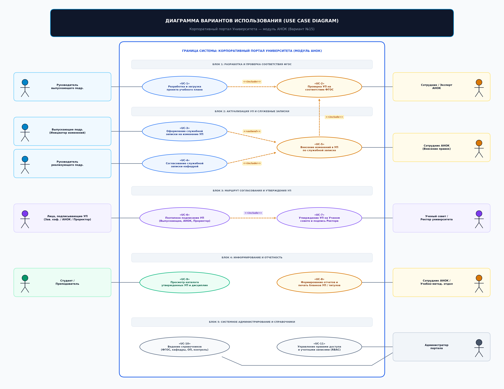

# Лабораторная работа № 1
## Выявление требований к порталу и составление их формализованного описания. Выбор инструментального средства для создания портала

**Вариант 15:** Университет. Центр аккредитации и независимой оценки качества образования (АНОК)  
**Дисциплина:** Практикум по разработке корпоративного портала  
**Исполнитель:** студент группы П-41 Соловьёв А.С.  
**Город, год:** Москва, 2026 г.

---

## 1. Цель работы

Целью лабораторной работы является исследование предметной области Центра аккредитации и независимой оценки качества образования университета (Центр АНОК), выявление и формализация функциональных и нефункциональных требований к корпоративному порталу, разработка диаграммы вариантов использования (Use Case Diagram), а также проведение сравнительного анализа и обоснование выбора инструментального программного стека на основе бесплатного ПО с поддержкой PHP и реляционной СУБД MySQL/MariaDB (SQLite).

---

## 2. Описание предметной области

Центр АНОК выполняет ключевую роль в обеспечении соответствия образовательной деятельности университета требованиям Федеральных государственных образовательных стандартов высшего образования (ФГОС ВО 3++), локальных нормативных актов и регламентов аккредитационной экспертизы.

Ключевым объектом автоматизации является **Учебный план (УП)** образовательной программы высшего образования, представляющий собой сложную структурированную сетку дисциплин, практик и государственной итоговой аттестации (ГИА), распределенных по семестрам с фиксацией академических часов (лекции, лабораторные, практические, самостоятельная работа студента — СРС), зачетных единиц (з.е.) и форм промежуточного контроля (экзамен, зачет, зачет с оценкой, курсовой проект/работа).

### Основные бизнес-процессы Центра АНОК:
1. **Инициация и разработка проекта УП:** Выпускающие кафедры формируют проект учебного плана образовательной программы бакалавриата (240 з.е.) или магистратуры (120 з.е.).
2. **Экспертиза и автоматическая валидация:** Центр АНОК выполняет проверку плана на выполнение обязательных ограничений ФГОС ВО 3++:
   * Суммарная трудоемкость программы (240 з.е. для бакалавриата, ровно 30 з.е. в каждом семестре);
   * Количество экзаменов в одну экзаменационную сессию ($\le 5$ экзаменов);
   * Объем практической подготовки ($\ge 12$ з.е.);
   * Объем государственной итоговой аттестации ($\ge 6$ з.е.);
   * Корректность закрепления дисциплин за обеспечивающими кафедрами.
3. **Маршрут согласования и утверждения:** Проект УП последовательно визируется: Заведующий выпускающей кафедрой $\rightarrow$ Эксперт/Начальник АНОК $\rightarrow$ Проректор по учебной работе $\rightarrow$ Ректор университета с фиксацией номера и даты протокола Ученого совета.
4. **Внесение оперативных изменений (Служебные записки):** При необходимости перераспределения часов, смены формы контроля или обеспечивающей кафедры оформляется электронная служебная записка (СЗ) с двусторонним согласованием (выпускающая + реализующая кафедры) и проверкой сохранения итогового баланса зачетных единиц.

---

## 3. Описание основных акторов системы

| Актор | Роль в системе | Основные функции и зоны ответственности |
|---|---|---|
| **Руководитель выпускающего подразделения (Зав. кафедрой)** | `HEAD_RELEASING` | Формирование проектов учебных планов ОП, первичное визирование ЭЦП, создание служебных записок на корректировку дисциплин. |
| **Руководитель реализующего подразделения (Обеспечивающая каф.)** | `HEAD_IMPLEMENTING` | Согласование параметров закрепленных дисциплин (часы, формы контроля), визирование служебных записок. |
| **Эксперт Центра АНОК** | `EXPERT_ANOK` | Проведение автоматизированной и содержательной экспертизы УП по ФГОС ВО 3++, фиксация замечаний, применение утвержденных служебных записок. |
| **Начальник Центра АНОК** | `HEAD_ANOK` | Утверждение результатов аккредитационной экспертизы, наложение визы АНОК в маршруте согласования. |
| **Проректор по учебной работе** | `VICE_RECTOR` | Согласование учебного плана на уровне руководства университета перед вынесением на Ученый совет. |
| **Ректор университета** | `RECTOR` | Финальное утверждение учебного плана на основании решения Ученого совета университета. |
| **Секретарь Ученого совета** | `COUNCIL_SEC` | Регистрация реквизитов протоколов заседаний Ученого совета по утверждению и актуализации ОП. |
| **Преподаватель / Студент** | `VIEWER` | Просмотр утвержденных учебных планов, матриц компетенций, календарных графиков и объявлений. |
| **Администратор портала** | `ADMIN` | Управление пользователями, ролями, нормативными справочниками ФГОС, аудит безопасности и мониторинг. |

---

## 4. Диаграмма вариантов использования (Use Case)

Диаграмма вариантов использования отражает функциональные возможности портала для ключевых групп пользователей:

### Основные группы прецедентов:
* **Подсистема учебных планов:** «Просмотр реестра УП», «Просмотр учебного плана по семестрам (1–8)», «Анализ аудиторной нагрузки и СРС», «Фильтрация по кафедрам».
* **Подсистема аккредитационной экспертизы:** «Автоматическая валидация по ФГОС ВО 3++», «Контроль лимита экзаменов в сессию ($\le 5$)», «Контроль объема практик и ГИА», «Формирование протокола замечаний».
* **Подсистема электронного согласования:** «Наложение цифровой визы ЭЦП», «Просмотр цепочки подписания и хэшей SHA-256», «Утверждение протокола Ученого совета».
* **Подсистема служебных записок:** «Создание СЗ на изменение УП», «Сравнение версий дисциплины ("Было" $\rightarrow$ "Стало")», «Согласование обеспечивающей кафедрой», «Применение правок в УП».
* **Справочно-информационная подсистема:** «Просмотр матрицы компетенций (УК, ОПК, ПК)», «Справочник подразделений и контактов», «Лента регламентов и объявлений АНОК», «Журнал аудита действий».

---

## 5. Требования к корпоративному порталу

### 5.1. Функциональные требования
1. **ФТ-01 (Хранение ОП и УП):** Хранение реестра образовательных программ с кодами направлений, уровнями образования, формами обучения и связанными версиями учебных планов.
2. **ФТ-02 (Сетка дисциплин):** Хранение дисциплин с детализацией по семестрам (1–8), зачетным единицам, общим часам, часам лекций, лабораторных, практик, СРС и формам контроля.
3. **ФТ-03 (Семестровая навигация):** Интерактивный просмотр учебного плана с переключением семестров и автоматическим расчетом промежуточных итогов.
4. **ФТ-04 (Нормативы ФГОС):** Ведение справочника стандартов ФГОС ВО 3++ с пороговыми значениями (общие кредиты, макс. экзаменов, мин. практик, мин. ГИА).
5. **ФТ-05 (Валидация):** Автоматическая проверка плана на соответствие критериям ФГОС с индикацией статуса.
6. **ФТ-06 (Маршрут согласования):** Фиксация шагов визирования УП, ФИО подписантов, дат, статусов и криптографических хэшей подписей.
7. **ФТ-07 (Служебные записки):** Формирование СЗ с фиксацией выпускающей и реализующей кафедр, текстового обоснования и дифференциальных изменений дисциплин.
8. **ФТ-08 (Матрица компетенций):** Хранение и отображение категорий компетенций (УК, ОПК, ПК), их формулировок и дескрипторов.
9. **ФТ-09 (Справочник кафедр):** Ведение структуры подразделений с разделением на выпускающие, реализующие, экспертные и руководящие.
10. **ФТ-10 (Объявления):** Публикация регламентов и объявлений с поддержкой закрепления важных записей.
11. **ФТ-11 (Журнал аудита):** Протоколирование всех операций (время, пользователь, роль, действие, объект, статус, IP-адрес).
12. **ФТ-12 (Карта сайта):** Наличие интерактивной карты сайта со всеми разделами системы.

### 5.2. Нефункциональные требования
1. **НФТ-01 (Производительность):** Время отклика сервера при формировании страниц не должно превышать 200 мс при стандартной нагрузке.
2. **НФТ-02 (Надежность и транзакционность):** Целостность данных обеспечивается связями первичных и внешних ключей (`Foreign Keys`).
3. **НФТ-03 (Безопасность):** Использование подготовленных запросов (`Prepared Statements`) для исключения SQL-инъекций; экранирование вывода HTML (`htmlspecialchars`) для защиты от XSS.
4. **НФТ-04 (Кроссплатформенность и переносимость):** Возможность автономного развертывания как на стеке PHP/MySQL, так и на легковесном стеке Python/SQLite без внешних закрытых зависимостей.
5. **НФТ-05 (Адаптивность):** Корректное отображение на мониторах ПК, планшетах и мобильных устройствах.
6. **НФТ-06 (Эргономика):** Единый строгий корпоративный стиль оформления с визуальным цветовым кодированием статусов документов.

---

## 6. Сравнительный анализ инструментальных программных средств

В соответствии с заданием выполнен сравнительный анализ бесплатных инструментальных платформ с открытым исходным кодом, поддерживающих PHP и реляционные СУБД MySQL / MariaDB / SQLite.

| Критерий сравнения | Drupal | Joomla | Laravel | Native PHP + PDO / Light Server |
|---|---|---|---|---|
| **Лицензия и стоимость** | Бесплатно (GPL) | Бесплатно (GPL) | Бесплатно (MIT) | Бесплатно (Open Source) |
| **Язык разработки** | PHP 8.x | PHP 8.x | PHP 8.x | PHP 8.x / Python 3.x |
| **Поддерживаемые СУБД** | MySQL, MariaDB, PostgreSQL | MySQL, MariaDB | MySQL, PostgreSQL, SQLite | MySQL, MariaDB, SQLite |
| **Требования к ресурсам** | Высокие ($\ge 256$ MB RAM) | Средние ($\ge 128$ MB RAM) | Средние ($\ge 128$ MB RAM) | Минимальные ($< 32$ MB RAM) |
| **Сложность развертывания** | Высокая (Composer, Drush, Nginx) | Средняя (инсталлятор) | Высокая (Composer, Artisan, Node) | Нулевая (запуск одной командой) |
| **Кастомизация структур данных** | Модули CCK/Fields | Расширения компонентов | Eloquent ORM / миграции | Прямой SQL DDL / DML |
| **Прозрачность архитектуры** | Избыточна для прототипа | Избыточна для прототипа | Скрыта за абстракциями | 100% прозрачность для учебного анализа |
| **Безопасность запросов** | Встроенный API | Встроенный API | Query Builder | PDO Prepared Statements |

### Обоснование выбранного решения:
Для учебного корпоративного портала Центра АНОК выбран **нативный стек PHP / Python с PDO / SQLite / MySQL**. Данный выбор обоснован следующими факторами:
1. **Полное соответствие заданию:** соблюдены все требования к бесплатному ПО, архитектуре PHP/Python, СУБД MySQL/MariaDB/SQLite.
2. **Прозрачность реализации:** демонстрация непосредственной реляционной схемы данных (13 таблиц), маршрутизации страниц и выполнения подготовленных SQL-запросов без накладных расходов тяжеловесных CMS.
3. **Автономность и мобильность:** возможность мгновенного запуска и демонстрации прототипа в изолированных средах и веб-песочницах без необходимости настройки сложной инфраструктуры.

---

## 7. Заключение

В рамках лабораторной работы № 1 полностью исследована предметная область Центра АНОК университета, выделены 9 ролей пользователей (акторов), разработана диаграмма вариантов использования (Use Case), сформулированы 12 функциональных и 6 нефункциональных требований, проведен сравнительный анализ CMS/фреймворков и обоснован выбор стека разработки.
