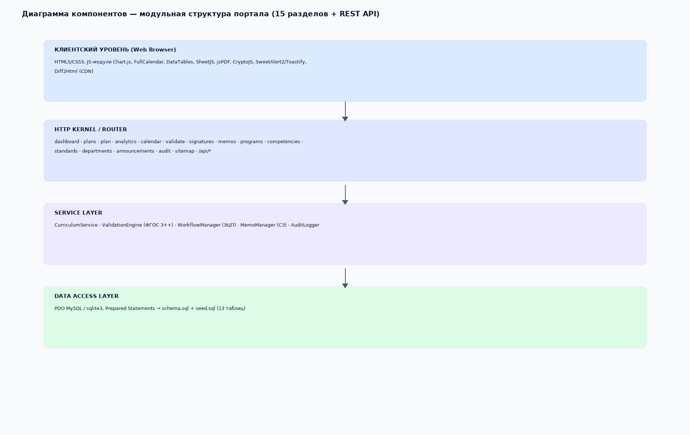
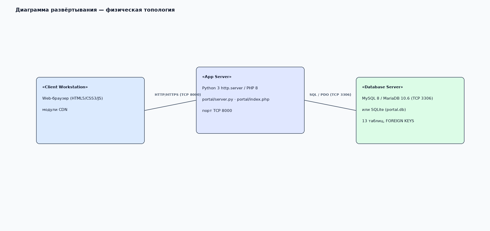
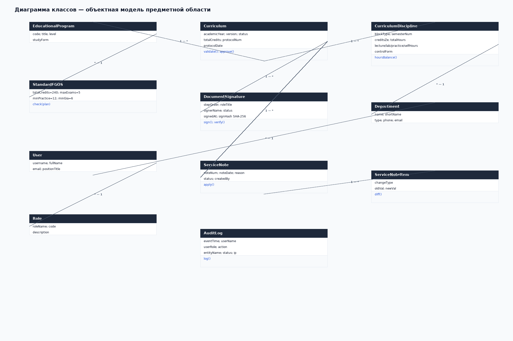
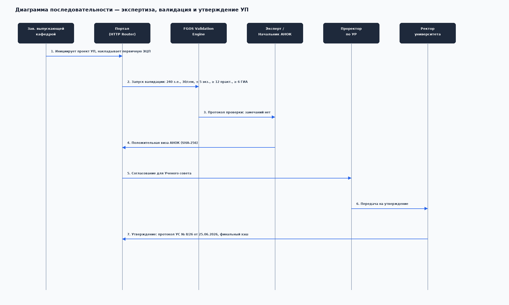
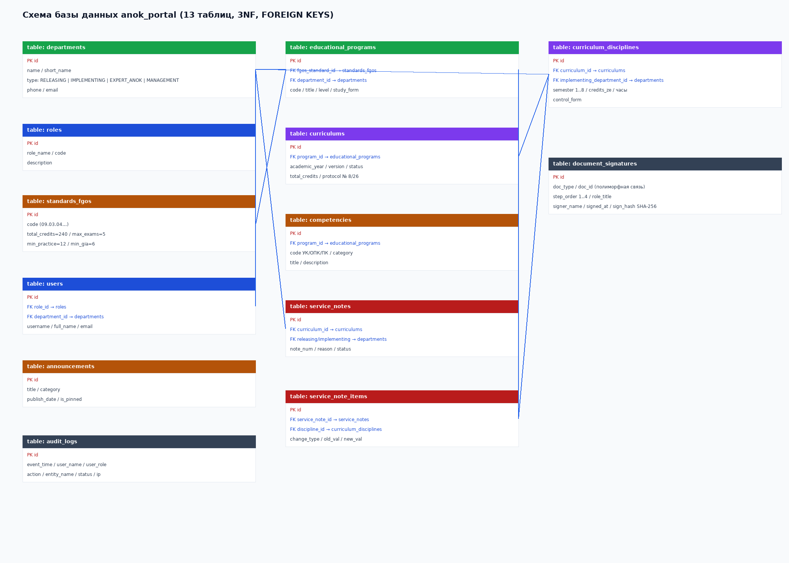
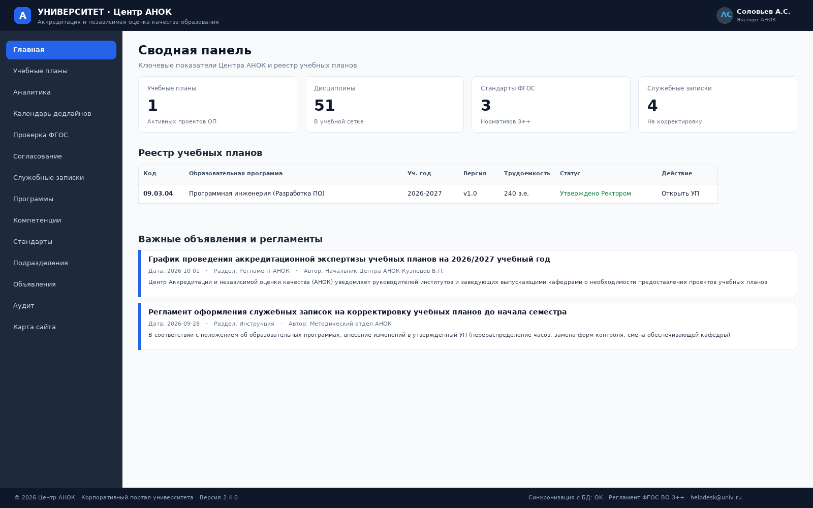
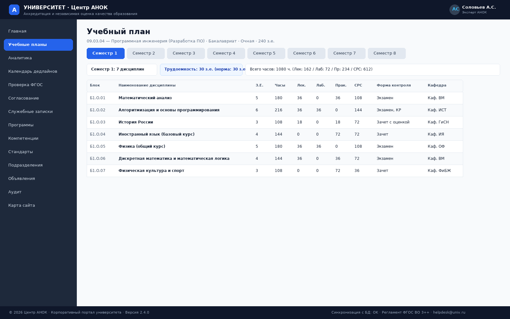
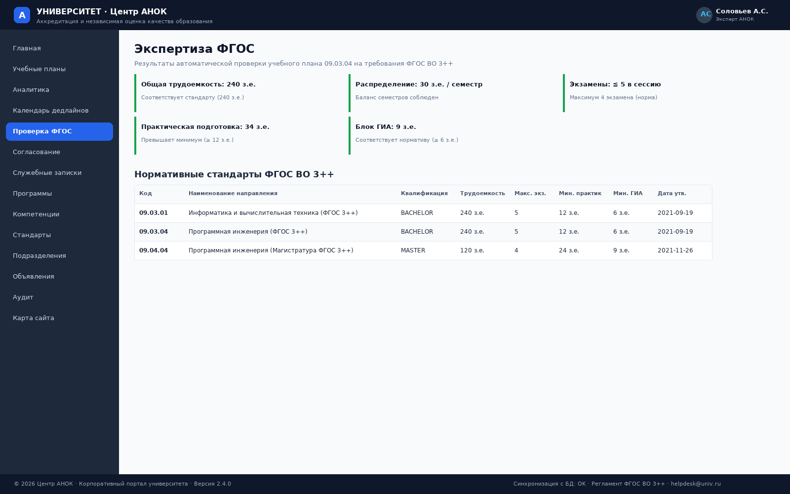
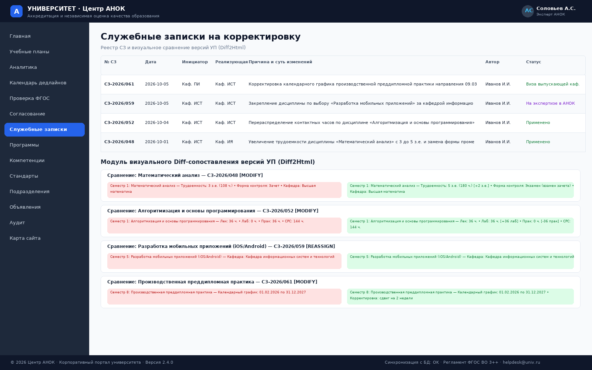

# Лабораторная работа № 2
## Анализ и проектирование портала. Развёртывание программного обеспечения

**Вариант 15:** Университет. Центр аккредитации и независимой оценки качества образования (АНОК)  
**Дисциплина:** Практикум по разработке корпоративного портала  
**Исполнитель:** студент группы П-41 Соловьёв А.С.  
**Город, год:** Москва, 2026 г.

---

## 1. Цель работы

Разработать комплекс архитектурных моделей корпоративного портала Центра АНОК (диаграмму компонентов, диаграмму развертывания, диаграмму классов, диаграмму последовательности и реляционную схему базы данных), спроектировать структуру таблиц базы данных в формате SQL DDL, развернуть серверное программное обеспечение и продемонстрировать примеры функционирования портала.

---

## 2. Архитектурное проектирование портала

### 2.1. Диаграмма компонентов (Component Diagram)
Диаграмма компонентов определяет модульную структуру системы и распределение обязанностей между уровнями представления, бизнес-логики и хранения данных:



* **Клиентский уровень (Web Browser):** Отвечает за рендеринг HTML/CSS интерфейса, интерактивное переключение вкладок семестров и динамическую фильтрацию таблиц на JavaScript.
* **Уровень маршрутизации и контроллеров (HTTP Kernel / Router):** Принимает входящие HTTP GET/POST запросы, выполняет диспетчеризацию страниц (`dashboard`, `plans`, `plan`, `analytics`, `calendar`, `validate`, `signatures`, `memos`, `programs`, `competencies`, `standards`, `departments`, `announcements`, `audit`, `sitemap`) и REST-эндпоинтов (`/api/stats`, `/api/plans`, `/api/announcements`).
* **Уровень бизнес-логики (Service Layer):**
  * `CurriculumService` — расчет кредитов, часов, балансировка семестровой нагрузки;
  * `ValidationEngine` — алгоритмическая проверка параметров плана на соответствие нормативам ФГОС ВО 3++;
  * `WorkflowManager` — управление цепочкой визирования и регистрация электронных цифровых подписей (ЭЦП);
  * `MemoManager` — обработка служебных записок на изменение дисциплин;
  * `AuditLogger` — сквозное протоколирование действий пользователей.
* **Уровень доступа к данным (Data Access Layer):** PDO / SQLite DB Layer с использованием параметризованных подготовленных запросов (`Prepared Statements`).

---

### 2.2. Диаграмма развёртывания (Deployment Diagram)
Диаграмма развертывания отображает физическую топологию вычислительных узлов, сетевые протоколы и размещение программных компонентов:



* **Рабочее место пользователя (Client Workstation):** Современный веб-браузер с поддержкой HTML5/CSS3. Взаимодействие осуществляется по протоколу HTTP/HTTPS через TCP-порт 8000.
* **Сервер приложений (Web & Application Server):** Многопоточный HTTP-сервер портала (PHP / Python runtime), обеспечивающий обработку входящих соединений, генерацию динамического контента и исполнение бизнес-правил.
* **Сервер баз данных (Database Server):** Реляционная СУБД MySQL/MariaDB (порт 3306) или встроенный высокопроизводительный движок SQLite (`portal.db`), обеспечивающий надежное транзакционное хранение (ACID) нормативно-справочных данных.

---

### 2.3. Диаграмма классов (Class Diagram)
Диаграмма классов описывает объектную модель предметной области и взаимосвязи сущностей:



* `Curriculum` (Учебный план) — агрегирует коллекцию дисциплин `CurriculumDiscipline`, связан с образовательной программой `EducationalProgram` и этапами визирования `DocumentSignature`.
* `CurriculumDiscipline` (Дисциплина плана) — содержит атрибуты трудоемкости (`credits_ze`, `total_hours`, `lecture_hours`, `lab_hours`, `practice_hours`, `self_study_hours`), форму контроля и ссылку на обеспечивающую кафедру `Department`.
* `StandardFGOS` (Стандарт ФГОС) — содержит нормативные пороги (`total_credits`, `max_exams_per_session`, `min_practice_credits`, `min_gia_credits`).
* `ServiceNote` и `ServiceNoteItem` — описывают заявку на изменение дисциплины («Было» $\rightarrow$ «Стало») с маршрутом согласования между кафедрами.
* `User` и `Role` — обеспечивают идентификацию пользователей и ролевое разграничение прав доступа.
* `AuditLog` — сохраняет неизменяемый журнал событий безопасности.

---

### 2.4. Диаграмма последовательности (Sequence Diagram)
Диаграмма последовательности отражает сквозной сценарий экспертизы, автоматической валидации и утверждения учебного плана:



1. Заведующий выпускающей кафедрой инициирует проект УП и накладывает первичную подпись.
2. Система запускает модуль `FGOS Validation Engine`, выполняющий проверку контрольных соотношений (240 з.е., $\le 5$ экзаменов, $\ge 12$ з.е. практик).
3. Эксперт Центра АНОК верифицирует протокол проверки и накладывает положительную визу.
4. Проректор по учебной работе согласует проект для передачи на рассмотрение Ученого совета.
5. Ректор университета утверждает учебный план с фиксацией реквизитов протокола Ученого совета (№ 8/26 от 25.06.2026) и формированием финального цифрового хэша.

---

## 3. Схема и структура базы данных

Реляционная база данных портала `anok_portal` спроектирована в 3-й нормальной форме (3NF) и включает 13 взаимосвязанных таблиц с объявленными в DDL ограничениями внешних ключей (`FOREIGN KEY`):



### Спецификация таблиц базы данных:

1. **`educational_programs` (Образовательные программы):**
   * `id` (PK), `code` (код направления, напр. 09.03.04), `title` (наименование), `level` (уровень образования), `study_form` (форма обучения), `fgos_standard_id` (FK $\rightarrow$ `standards_fgos`), `department_id` (FK $\rightarrow$ `departments`).
2. **`standards_fgos` (Нормативы ФГОС ВО 3++):**
   * `id` (PK), `code` (код стандарта), `title` (название), `degree_level` (квалификация), `total_credits` (норма з.е.), `max_exams_per_session` (макс. экзаменов), `min_practice_credits` (мин. практик), `min_gia_credits` (мин. ГИА), `approval_date` (дата утверждения).
3. **`curriculums` (Реестр учебных планов):**
   * `id` (PK), `program_id` (FK $\rightarrow$ `educational_programs`), `academic_year` (учебный год), `version` (версия), `status` (статус УП), `total_credits` (суммарная трудоемкость), `approved_protocol_num`, `approved_protocol_date`, `created_by_user`, `created_at`.
4. **`curriculum_disciplines` (Дисциплины учебного плана):**
   * `id` (PK), `curriculum_id` (FK $\rightarrow$ `curriculums`), `block_type` (индекс блока: Б1.О, Б1.В, Б2, Б3, ФТД), `discipline_name`, `semester_num` (1..8), `credits_ze`, `total_hours`, `lecture_hours`, `lab_hours`, `practice_hours`, `self_study_hours`, `control_form`, `implementing_department_id` (FK $\rightarrow$ `departments`).
5. **`competencies` (Матрица компетенций):**
   * `id` (PK), `program_id` (FK), `code` (УК-1..8, ОПК-1..6, ПК-1..4), `category` (категория), `title`, `description`.
6. **`departments` (Структурные подразделения):**
   * `id` (PK), `name` (полное наименование), `short_name`, `type` (`RELEASING`, `IMPLEMENTING`, `EXPERT_ANOK`, `MANAGEMENT`), `phone`, `email`.
7. **`document_signatures` (Маршрут согласования и ЭЦП):**
   * `id` (PK), `doc_type`, `doc_id`, `step_order` (1..4), `role_title`, `signer_name`, `status`, `comment`, `signed_at`, `sign_hash` (SHA-256).
8. **`service_notes` (Служебные записки на корректировку):**
   * `id` (PK), `curriculum_id` (FK), `note_num`, `note_date`, `reason`, `releasing_dept_id` (FK), `implementing_dept_id` (FK), `status`, `created_by`, `created_at`.
9. **`service_note_items` (Детализация изменений по СЗ):**
   * `id` (PK), `service_note_id` (FK), `discipline_id` (FK), `change_type`, `old_val`, `new_val`.
10. **`roles` (Справочник ролей):** `id` (PK), `role_name`, `code`, `description`.
11. **`users` (Пользователи системы):** `id` (PK), `username`, `full_name`, `email`, `role_id` (FK), `department_id` (FK), `position_title`.
12. **`announcements` (Объявления и регламенты):** `id` (PK), `title`, `category`, `publish_date`, `author_name`, `content`, `is_pinned`.
13. **`audit_logs` (Журнал аудита событий):** `id` (PK), `event_time`, `user_name`, `user_role`, `action`, `entity_name`, `status`, `ip_address`.

Исходные DDL-скрипты создания схемы расположены в `portal/database/schema.sql`, а демонстрационные данные — в `portal/database/seed.sql`.

---

## 4. Развёртывание и настройка программного обеспечения

### Вариант 1: Быстрый запуск (Python / встроенный SQLite)
Сервер портала поддерживает автономный запуск без внешних зависимостей. При первом старте база данных автоматически инициализируется из `schema.sql` и `seed.sql`:

```bash
# Запуск из корневой папки проекта
python3 server.py

# Или прямой запуск из директории портала
python3 portal/server.py
```
Сервер стартует по адресу: `http://0.0.0.0:8000`.

### Вариант 2: Запуск на стеке PHP и MySQL/MariaDB
1. Создать базу данных с кодировкой UTF-8:
   ```bash
   mysql -u root -p -e "CREATE DATABASE anok_portal CHARACTER SET utf8mb4 COLLATE utf8mb4_unicode_ci;"
   ```
2. Импортировать структуру таблиц и сиды:
   ```bash
   mysql -u root -p anok_portal < portal/database/schema.sql
   mysql -u root -p anok_portal < portal/database/seed.sql
   ```
3. Сконфигурировать переменные окружения и запустить встроенный PHP-сервер:
   ```bash
   export DB_HOST=127.0.0.1
   export DB_PORT=3306
   export DB_NAME=anok_portal
   export DB_USER=root
   export DB_PASSWORD=your_password
   php -S 0.0.0.0:8000 -t portal
   ```

---

## 5. Примеры работы установленного и настроенного ПО

После развертывания сервер отвечает на HTTP-запросы и отдает динамически сформированные страницы всех ключевых разделов портала. Ниже приведены примеры работающих страниц развернутого экземпляра портала (демонстрационная база `anok_portal`: 1 учебный план, 51 дисциплина, 3 стандарта ФГОС ВО 3++, 4 служебные записки, 9 подразделений, 7 записей аудита).

### 5.1. Сводная панель (`?page=dashboard`)
Стартовая страница портала отображает агрегированные карточки показателей (учебные планы, дисциплины, стандарты ФГОС, служебные записки), реестр учебных планов с быстрым переходом к детальному просмотру и ленту закрепленных объявлений Центра АНОК:



### 5.2. Просмотр учебного плана (`?page=plan&id=1&sem=1..8`)
Страница обеспечивает интерактивный просмотр учебного плана с переходом по семестрам (1–8) и контролем семестрового баланса: сумма 30 з.е. и 1080 академических часов на семестр, разбивка часов на лекции, лабораторные, практики и СРС, формы контроля и обеспечивающие кафедры. На приведенном снимке отображена сетка дисциплин плана 09.03.04 по семестру 1 (7 дисциплин, 30 з.е., 1080 часов: лекции 162 / лабораторные 72 / практики 234 / СРС 612) с обеспечивающими кафедрами; переключение семестров 1–8 выполняется навигационной панелью, суммарно план содержит 51 дисциплину (240 з.е., 8640 часов):



### 5.3. Автоматизированная экспертиза ФГОС (`?page=validate`)
Модуль валидации демонстрирует статус прохождения проверки по нормативам ФГОС ВО 3++: общая трудоемкость 240 з.е., баланс 30 з.е. в семестре, лимит экзаменов в сессию, объем практической подготовки и блока ГИА, а также справочник действующих стандартов:



### 5.4. Служебные записки на корректировку УП (`?page=memos`)
Раздел служебных записок фиксирует документооборот правок между выпускающей и обеспечивающей кафедрами: инициатор, согласующая кафедра, основание изменения, визуальное сравнение параметров дисциплины «Было» $\rightarrow$ «Стало» и статус рассмотрения заявки в Центре АНОК:



Все страницы формируются серверным движком из базы данных с использованием подготовленных параметризованных запросов, что подтверждает корректность развертывания и настройки программного обеспечения портала.

---

## 6. Заключение

В ходе выполнения лабораторной работы № 2 разработаны 5 ключевых архитектурных UML-диаграмм, спроектирована 3NF реляционная схема базы данных из 13 таблиц, настроена серверная среда и выполнено успешное развертывание портала с демонстрационными данными.
