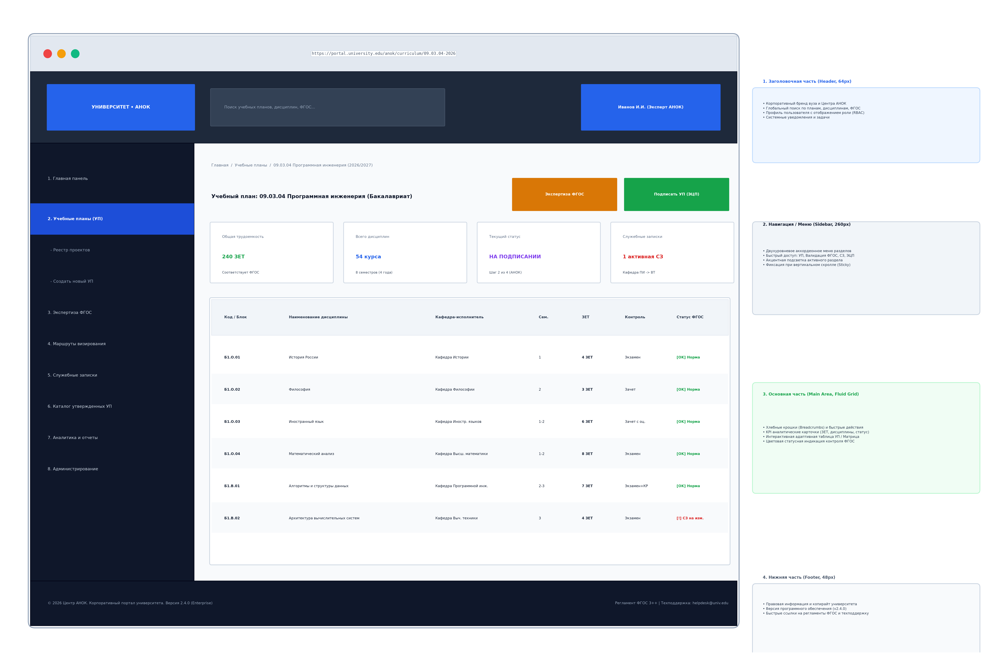
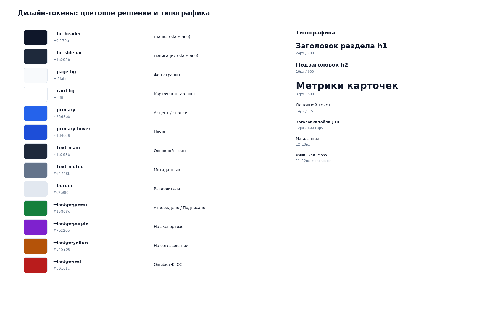
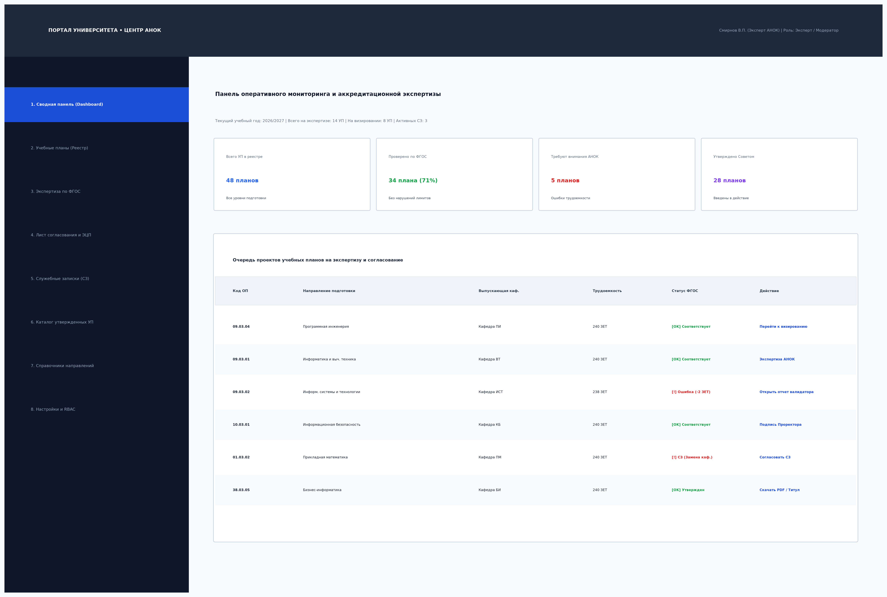
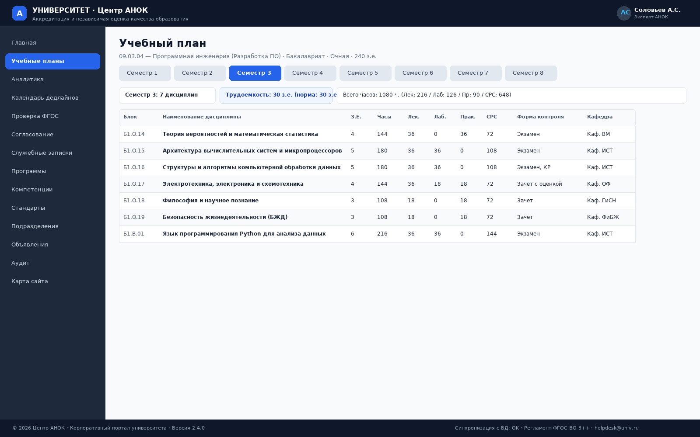
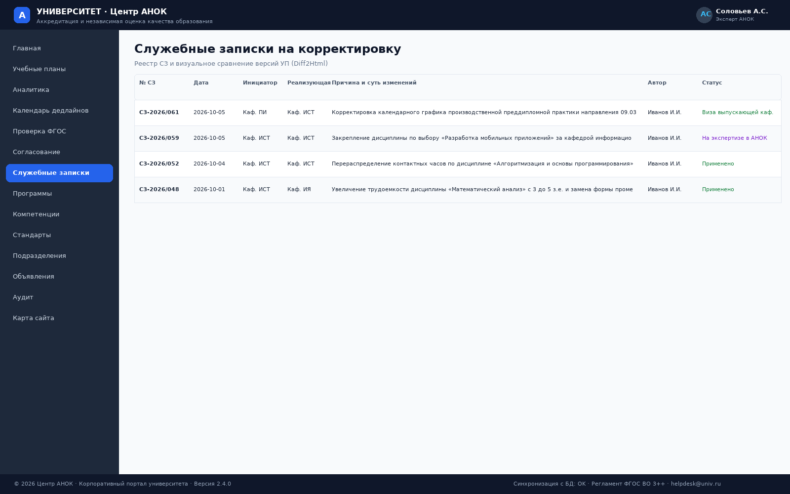

# Лабораторная работа № 3
## Создание шаблона дизайна портала и главных пользовательских интерфейсов

**Вариант 15:** Университет. Центр аккредитации и независимой оценки качества образования (АНОК)  
**Дисциплина:** Практикум по разработке корпоративного портала  
**Исполнитель:** студент группы П-41 Соловьёв А.С.  
**Город, год:** Москва, 2026 г.

---

## 1. Цель работы

Разработать модульный шаблон дизайна корпоративного портала Центра АНОК (включая компоновку страницы, сеточную структуру, цветовую палитру, типографику, адаптивные правила) и спроектировать главные пользовательские интерфейсы (ГПИ) для всех ключевых сценариев взаимодействия сотрудников университета.

---

## 2. Разработка шаблона дизайна портала

Шаблон дизайна корпоративного портала Центра АНОК построен на основе современных принципов чистого, контрастного и функционального академического UI/UX дизайна:

### 2.1. Анатомия разметки страницы (Page Layout)
* **Заголовочная часть (Header, высота 60px):**
  * Закреплена в верхней части экрана (`position: sticky; top: 0; z-index: 100`).
  * Фирменный логотип Центра АНОК с монограммой «А».
  * Наименование: «УНИВЕРСИТЕТ · Центр АНОК» с расшифровкой «Центр аккредитации и независимой оценки качества образования».
  * Профиль текущего авторизованного пользователя с аватаром (Эксперт АНОК Соловьёв А.С.).
* **Боковая навигационная панель (Sidebar Navigation, ширина 240px):**
  * Темный фон (`#1e293b`), обеспечивающий четкое визуальное разделение навигации и контента.
  * 12 разделов меню с визуальными пиктограммами и текстовыми метками.
  * Индикация активного пункта меню с акцентной синей подсветкой и тенью (`#2563eb`).
* **Основная рабочая область (Main Content Area):**
  * Максимальная ширина 1200px с комфортными отступами (`padding: 32px`).
  * Заголовок страницы (`h1`), подзаголовок с кратким описанием раздела.
  * Сетка аналитических карточек метрик (Grid layout).
  * Табличные контейнеры данных со скруглением углов (`border-radius: 10px`), мягкой тенью и горизонтальной прокруткой для таблиц с большим числом колонок.
* **Нижняя часть / футер (Footer):**
  * Встроенная информационная строка статуса синхронизации и версии системы.

---

### 2.2. Цветовое решение и дизайн-токены (Design Tokens)

| Элемент / Токен | Hex-код | Назначение в интерфейсе |
|---|---|---|
| `--bg-header` | `#0f172a` | Темно-синий/графитовый цвет шапки (Slate-900) |
| `--bg-sidebar` | `#1e293b` | Темно-серый цвет навигационной панели (Slate-800) |
| `--page-bg` | `#f8fafc` | Светло-серый нейтральный фон страниц (Slate-50) |
| `--card-bg` | `#ffffff` | Чистый белый фон карточек и таблиц |
| `--primary` | `#2563eb` | Акцентный синий цвет (кнопки, активные ссылки, фокус) |
| `--primary-hover` | `#1d4ed8` | Состояние наведения интерактивных элементов |
| `--text-main` | `#0f172a` / `#1e293b` | Основной высококонтрастный текст |
| `--text-muted` | `#64748b` | Второстепенный поясняющий текст и метаданные |
| `--border` | `#e2e8f0` | Тонкие разделительные линии таблиц и карточек |
| `--badge-green` | `#dcfce7` / `#15803d` | Статусы: «Утверждено», «Подписано», «Успешно» |
| `--badge-blue` | `#dbeafe` / `#1d4ed8` | Статусы: «Обновлено», «Создано», базовые теги |
| `--badge-purple` | `#f3e8ff` / `#7e22ce` | Статусы: «На экспертизе в АНОК», «Закреплено» |
| `--badge-yellow` | `#fef3c7` / `#b45309` | Статусы: «На согласовании», «В процессе» |
| `--badge-red` | `#fee2e2` / `#b91c1c` | Статусы: «Ошибка», «Замечание ФГОС» |

### 2.3. Типографика и шрифтовая шкала
* **Шрифтовой стек:** системный стек шрифтов без внешних веб-зависимостей: `-apple-system, BlinkMacSystemFont, "Segoe UI", Roboto, "Helvetica Neue", Arial, sans-serif`.
* **Иерархия размеров шрифтов:**
  * Заголовок раздела `h1`: 24px, жирный (`font-weight: 700`), цвет `#0f172a`.
  * Подзаголовок `h2`: 18px, полужирный (`font-weight: 600`), цвет `#1e293b`.
  * Числовые метрики карточек: 32px, сверхжирный (`font-weight: 800`), цвет `#0f172a`.
  * Основной текст: 14px, нормальный (`line-height: 1.5`), цвет `#1e293b`.
  * Заголовки таблиц `th`: 12px, прописные буквы, полужирный (`font-weight: 600`), цвет `#475569`.
  * Метаданные и сноски: 12px / 13px, цвет `#64748b`.
  * Моноширинные коды (хэши, блоки): `font-family: monospace; font-size: 11px/12px`.

### 2.4. Адаптивные правила (Responsive Design)
При уменьшении ширины экрана ($\le 768px$):
* Боковое меню компактно сворачивается в полосу шириной 70px с центрированными иконками.
* Таблицы автоматически получают горизонтальную полосу прокрутки (`overflow-x: auto`), предотвращая искажение контента.
* Карточки сводной панели перестраиваются в одноколоночную сетку.

---

## 3. Главные пользовательские интерфейсы (ГПИ)

В рамках лабораторной работы спроектированы и реализованы 5 главных пользовательских интерфейсов:

### 3.1. ГПИ-1: Сводная аналитическая панель (Dashboard)

* 4 интерактивные карточки верхнего уровня (Учебные планы, Дисциплины, Стандарты ФГОС, Служебные записки).
* Сводный реестр учебных планов с быстрым переходом к детальному просмотру.
* Лента важных объявлений и регламентов Центра АНОК.

### 3.2. ГПИ-2: Просмотр и навигация по учебному плану (Curriculum Viewer)

* Карточка паспорта образовательной программы (код 09.03.04, уровень «Бакалавриат», форма «Очная», общая трудоемкость 240 з.е., выпускающая кафедра).
* Навигационная панель переключения семестров (кнопки «Семестр 1» ... «Семестр 8»).
* Информационная плашка семестрового баланса: количество дисциплин, сумма зачетных единиц (норма 30 з.е.), сумма часов (1080 ч.) с разбивкой на лекции, лабораторные, практики и СРС.
* Детализированная таблица дисциплин семестра с блоками (Б1.О, Б1.В, Б2, Б3, ФТД), формами контроля и обеспечивающими кафедрами.

### 3.3. ГПИ-3: Модуль автоматизированной экспертизы ФГОС (FGOS Validation)

* Сводная карточка результатов верификации: 5 критериев соответствия ФГОС ВО 3++ (общая трудоемкость, баланс семестров, лимит экзаменов $\le 5$, практики $\ge 12$ з.е., ГИА $\ge 6$ з.е.).
* Таблица действующих образовательных стандартов высшего образования.

### 3.4. ГПИ-4: Маршрут электронного согласования и ЭЦП (Sign Workflow)

* Хронологическая цепочка 4 этапов визирования УП.
* Отображение ролей, ФИО подписантов, даты и времени наложения визы, экспертных комментариев и криптографических SHA-256 хэшей подписи.

### 3.5. ГПИ-5: Управление служебными записками (Service Notes)

* Реестр служебных записок на корректировку параметров плана с фиксацией инициатора, согласующей кафедры, причины изменений и статуса обработки в АНОК.

---

## 4. Заключение

В рамках лабораторной работы № 3 разработан адаптивный модульный шаблон дизайна корпоративного портала Центра АНОК, сформирована таблица дизайн-токенов и цветовой палитры, определены типографические стандарты и реализованы 5 главных пользовательских интерфейсов.
