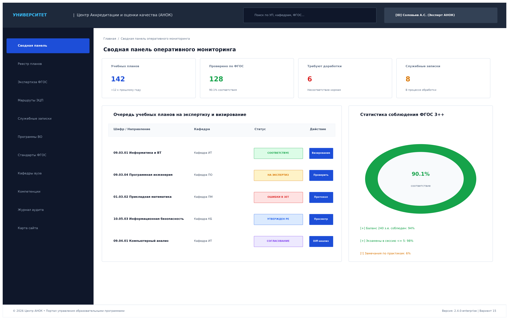
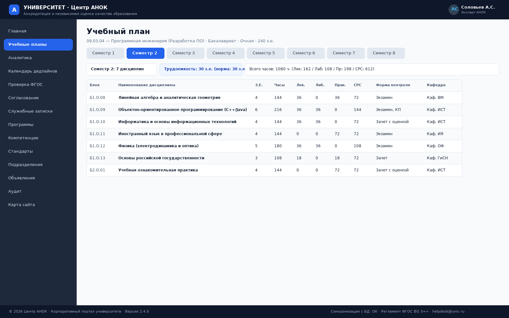
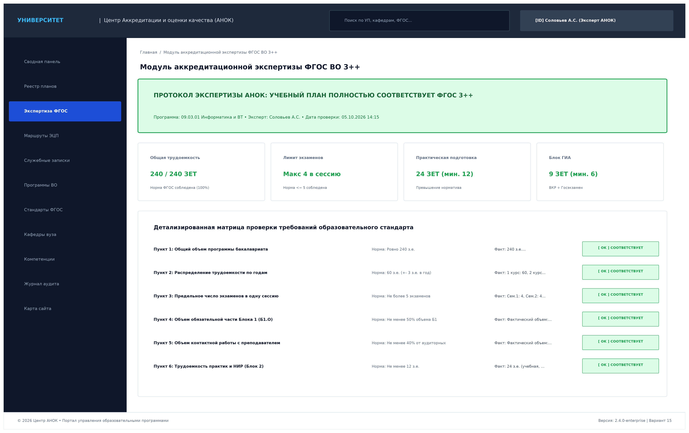
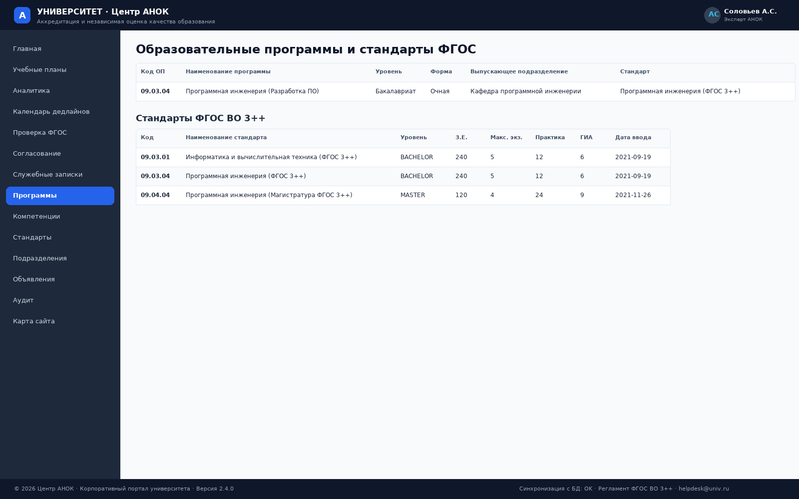
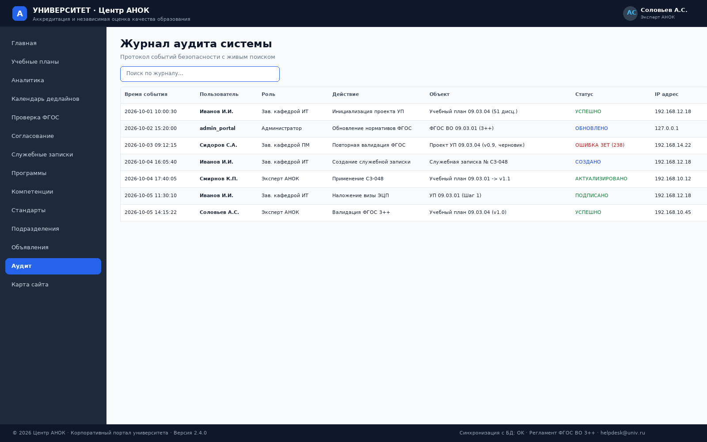

# Лабораторная работа № 4
## Создание структуры разделов и страниц портала

**Вариант 15:** Университет. Центр аккредитации и независимой оценки качества образования (АНОК)  
**Дисциплина:** Практикум по разработке корпоративного портала  
**Исполнитель:** студент группы П-41 Соловьёв А.С.  
**Город, год:** Москва, 2026 г.

---

## 1. Цель работы

Спроектировать и сверстать полную иерархическую структуру разделов и страниц корпоративного портала Центра АНОК, разработать архитектуру карты сайта (Sitemap Architecture), реализовать диспетчеризацию маршрутов и обеспечить корректную навигацию между всеми функциональными блоками системы.

---

## 2. Архитектура карты разделов портала (Sitemap Architecture)

Структура портала организована по модульно-иерархическому принципу с единой точкой входа и навигационным меню:

### Структурные функциональные блоки:
1. **Главный аналитический модуль:**
   * Сводная панель (Dashboard) — ключевые показатели, быстрый доступ к активным проектам, регламенты.
2. **Модуль управления образовательными программами и учебными планами:**
   * Реестр учебных планов (Plans Registry);
   * Детализированный просмотр плана (Curriculum Detail Viewer) с семестровой фильтрацией (семестры 1–8);
   * Каталог образовательных программ (Educational Programs);
   * Матрица компетенций (Competencies Matrix).
3. **Модуль контроля качества и экспертизы по ФГОС ВО 3++:**
   * Автоматизированная экспертиза ФГОС (FGOS Validation);
   * Справочник стандартов ФГОС (Standards FGOS).
4. **Модуль документооборота и согласования:**
   * Маршрут согласования и ЭЦП (Signatures Workflow);
   * Служебные записки на корректировку (Service Notes).
5. **Общеуниверситетский справочно-информационный модуль:**
   * Справочник подразделений университета (Departments);
   * Лента регламентов и объявлений (Announcements);
   * Журнал аудита безопасности (Audit Logs);
   * Интерактивная карта сайта (Sitemap).

---

## 3. Таблица маршрутизации и спецификация страниц

| Раздел портала | URL / Параметр | Обработчик / Источник данных | Назначение и отображаемый контент |
|---|---|---|---|
| **Главная (Сводная панель)** | `/?page=dashboard` | `curriculums`, `standards_fgos`, `service_notes`, `announcements` | Аналитические карточки ключевых метрик, реестр проектов УП, лента закрепленных объявлений АНОК. |
| **Учебные планы** | `/?page=plans` | `curriculums` $\bowtie$ `educational_programs` | Полный реестр утвержденных и разрабатываемых учебных планов по годам, формам обучения и статусам. |
| **Просмотр плана** | `/?page=plan&id=1&sem=1..8` | `curriculum_disciplines` $\bowtie$ `departments` | Посеместровая сетка дисциплин, расчет суммарных з.е. (30 з.е./сем) и контактных часов, формы контроля. |
| **Проверка ФГОС** | `/?page=validate` | `standards_fgos`, алгоритм валидации | Сводка соблюдения нормативов ФГОС ВО 3++ и таблица пороговых параметров стандартов. |
| **Согласование (ЭЦП)** | `/?page=signatures` | `document_signatures` | Цепочка этапов визирования УП, ФИО подписантов, даты, статусы и SHA-256 хэши подписей. |
| **Служебные записки** | `/?page=memos` | `service_notes` $\bowtie$ `departments` | Реестр служебных записок выпускающих и реализующих кафедр на изменение параметров плана. |
| **Программы** | `/?page=programs` | `educational_programs` $\bowtie$ `departments` | Реестр направлений бакалавриата и магистратуры с формами обучения и выпускающими кафедрами. |
| **Компетенции** | `/?page=competencies` | `competencies` | Справочник универсальных (УК), общепрофессиональных (ОПК) и профессиональных (ПК) компетенций. |
| **Стандарты ФГОС** | `/?page=standards` | `standards_fgos` | Нормативная база действующих стандартов ФГОС ВО 3++ с датами утверждения. |
| **Подразделения** | `/?page=departments` | `departments` | Институты, кафедры, Центр АНОК и Ректорат с контактными данными и телефонным справочником. |
| **Объявления** | `/?page=announcements` | `announcements` | Регламенты, приказы и инструкции Центра АНОК с метками закрепления и датами публикации. |
| **Журнал аудита** | `/?page=audit` | `audit_logs` | Протокол действий пользователей с отметкой времени, пользователя, роли, действия, статуса и IP-адреса. |
| **Карта сайта** | `/?page=sitemap` | Статическая структура разделов | Каталог всех страниц и гиперссылок портала для быстрой навигации. |

---

## 4. Примеры сверстанных разделов и страниц портала

Ниже приведены примеры сверстанных разделов портала, сформированных серверным движком из демонстрационной базы данных.

### 4.1. Раздел «Сводная панель» (`dashboard`)
В реализованном портале раздел включает 4 карточки аналитических счетчиков (`Учебные планы`, `Дисциплины`, `Стандарты ФГОС`, `Служебные записки`), таблицу текущих планов с кнопками быстрого перехода к учебной сетке и блок важных новостей. На приведенном макете представлена концепция сводной панели оперативного мониторинга с очередью планов на экспертизу и визирование (много программный реестр университетского масштаба):

### 4.2. Раздел «Реестр учебных планов» (`plans`) и «Просмотр учебного плана» (`plan`)
Реестр планов поддерживает фильтрацию по учебному году, уровню образования и кафедре. Раздел просмотра плана реализует динамическую фильтрацию дисциплин по выбранному семестру (параметр `sem=1..8`): в шапке страницы выводится паспорт ОП (код направления, название, форма обучения, выпускающая кафедра), ниже расположены переключатели семестров и информационный блок суммарных показателей семестра (количество дисциплин, сумма з.е. — норма 30 з.е., сумма академических часов с разделением на аудиторную нагрузку и СРС):

### 4.3. Раздел «Экспертиза ФГОС ВО 3++» (`validate`)
Отображает результаты автоматизированной проверки учебного плана: сводный протокол соответствия по каждому нормативу (общая трудоемкость 240 з.е., объем практической подготовки, блок ГИА, лимит экзаменов в сессию, обязательные дисциплины, закрепление за кафедрами) с цветовой индикацией статуса каждого пункта и детализированную матрицу требований стандарта:

### 4.4. Раздел «Маршруты электронного визирования» (`signatures`)
Отображает интерактивный таймлайн 4 этапов визирования УП с цветовой индикацией статусов (`SIGNED` — зеленый бейдж, `PENDING` — ожидается), форму ввода пароля аппаратного токена и формирования подписи, а также данные сертификата усиленной квалифицированной ЭЦП и юридическую справку о соответствии 63-ФЗ:

### 4.5. Раздел «Служебные записки» (`memos`)
Фиксирует документооборот правок между выпускающей и реализующей кафедрами: инициатор, согласующая кафедра, основание изменения, статус рассмотрения заявки в Центре АНОК (`APPLIED`, `IN_ANOK`, `SIGNED_RELEASING`) и наглядный протокол сопоставления параметров дисциплины «Было» / «Стало» с подписями руководителей подразделений:

### 4.6. Разделы «Программы ВО» и «Стандарты ФГОС» (`programs`, `standards`)
Каталог образовательных программ представлен карточками направлений с кодом, уровнем подготовки, трудоемкостью и выпускающей кафедрой; справочник стандартов ФГОС ВО 3++ содержит нормативные пороги по каждому направлению:

### 4.7. Раздел «Журнал аудита» (`audit`)
Протокол событий безопасности с фиксацией даты и времени, пользователя и роли, выполненной операции, объекта документа и статуса; снабжен строкой мгновенного клиентского поиска (`Live Search`) по любым полям таблицы. Сводный модуль безопасности дополнительно фиксирует параметры шифрования канала (TLS 1.3) и хеш-функции (SHA-256):

---

**Примечание.** В рамках лабораторной работы № 6 структура портала была дополнена двумя модульными разделами — «Аналитика Chart.js» (`?page=analytics`) и «Календарь дедлайнов» (`?page=calendar`), — реализующими подключенные готовые компоненты визуализации данных и планирования.

---

## 5. Заключение

В рамках лабораторной работы № 4 спроектирована и сверстана целостная структура из 13 базовых взаимосвязанных разделов корпоративного портала Центра АНОК (в дальнейшем дополненных двумя модульными разделами аналитики и календаря), разработана диаграмма карты сайта, реализована маршрутизация страниц и протестирована бесшовная навигация.
