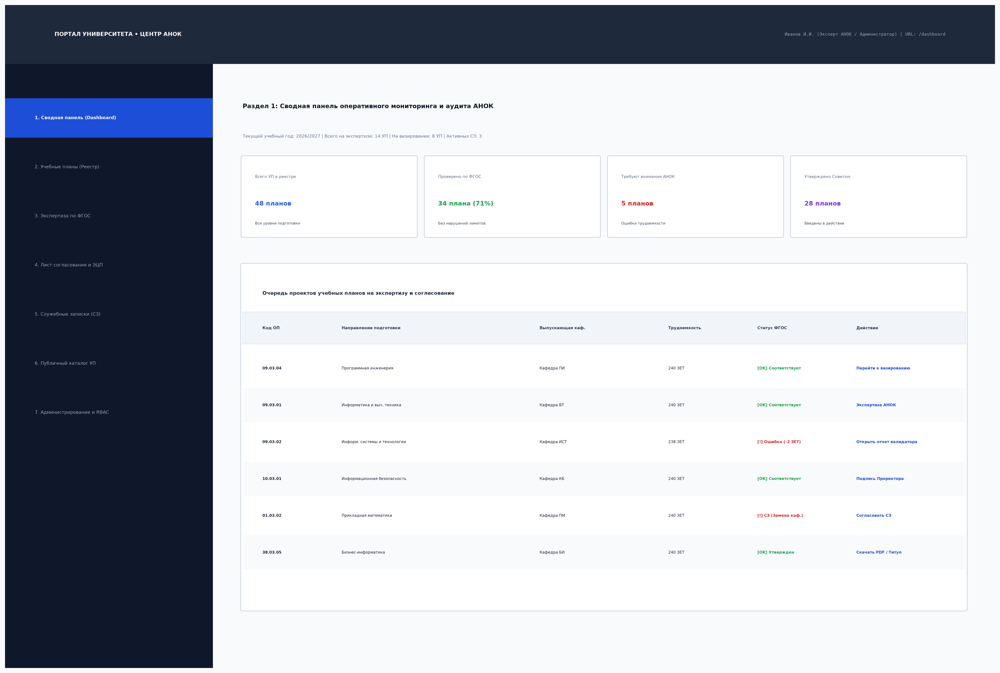
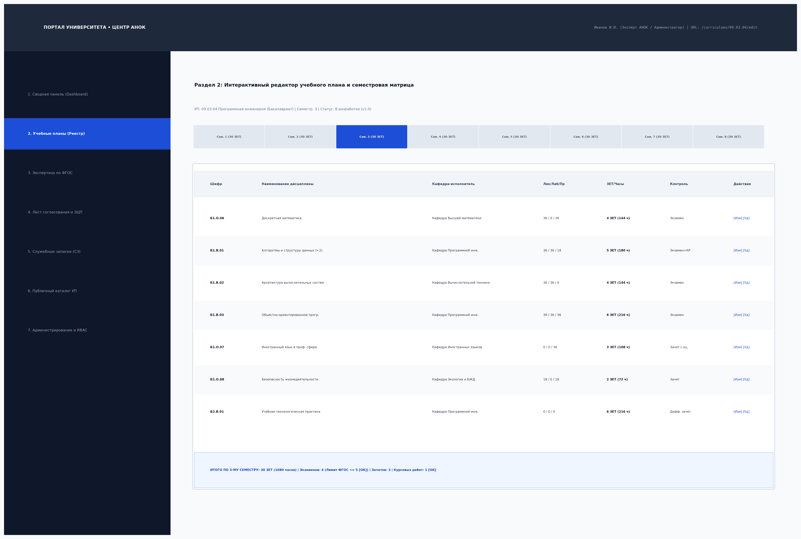
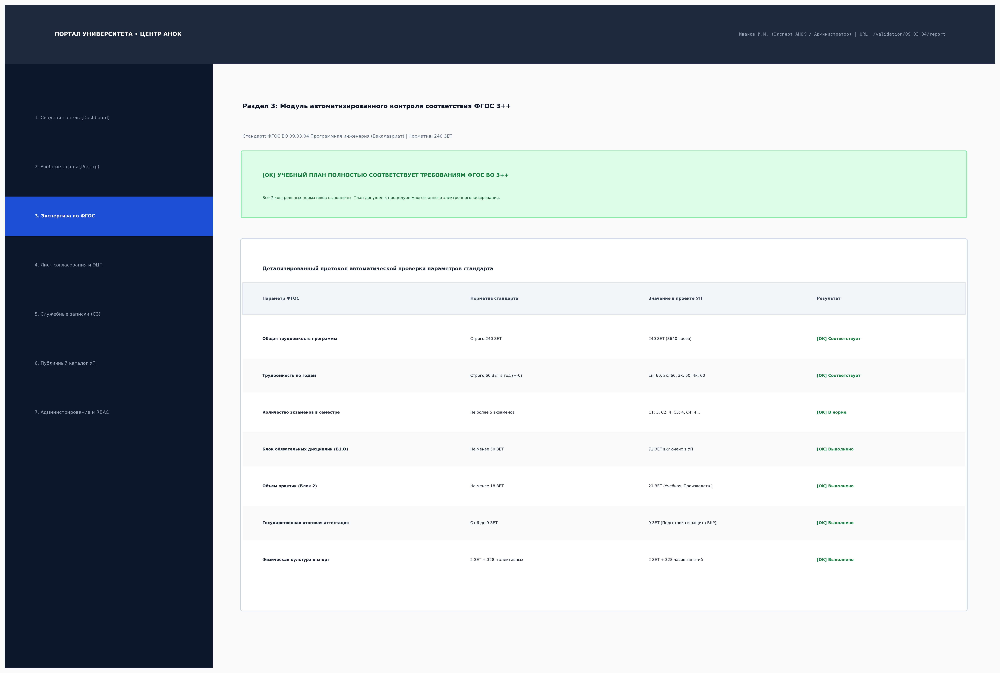
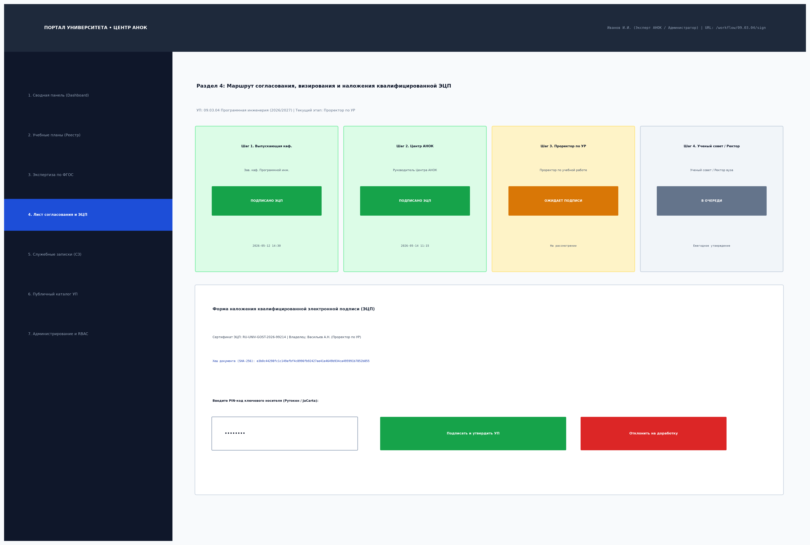
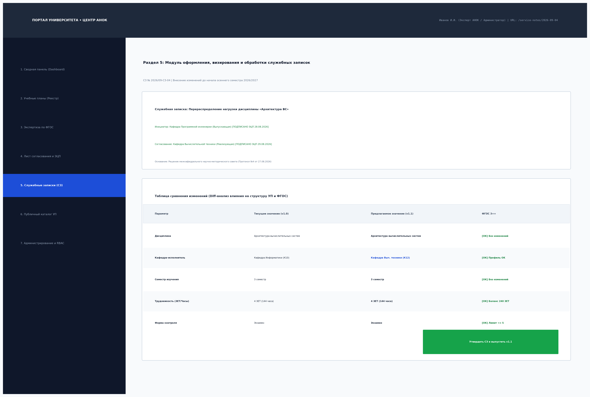
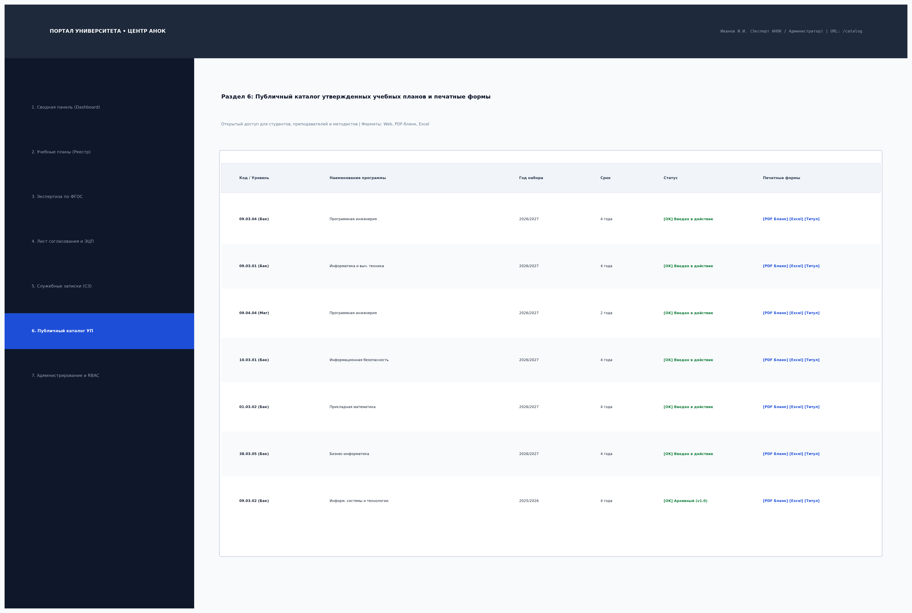
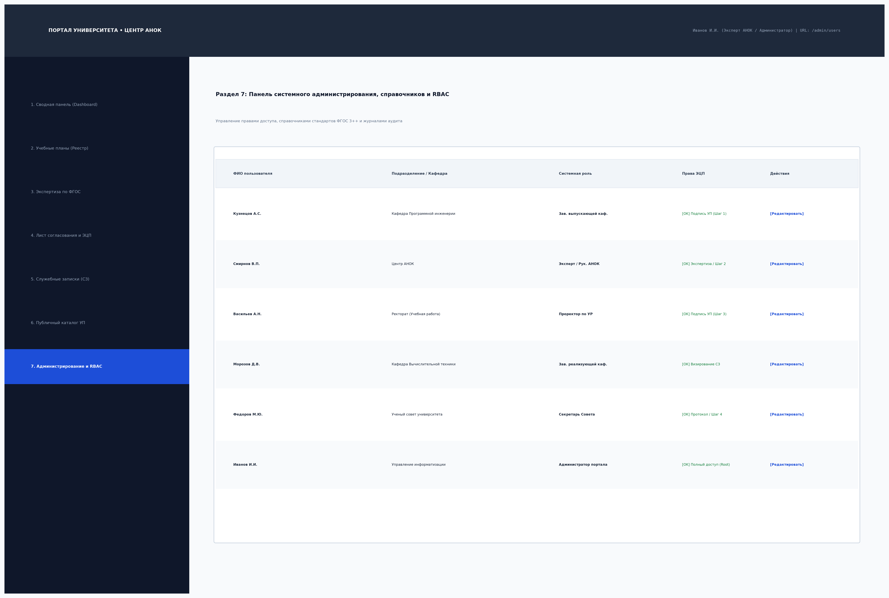

# Отчет по лабораторной работе №4
## Тема: Создание структуры разделов и страниц корпоративного портала
### Дисциплина: Практикум по разработке корпоративного портала (ПРКП)
### Вариант №15: Университет. Центр аккредитации и независимой оценки качества образования (АНОК)

---

## 1. Введение и цели работы

**Цель лабораторной работы:** Проектирование и программная реализация целостной структуры разделов и страниц корпоративного портала университета (Модуль Центра АНОК), обеспечивающей реализацию сквозного жизненного цикла учебных планов (УП) согласно Варианту №15: от разработки кафедрами и проверки по ФГОС до многоэтапного визирования, межкафедральной корректировки по служебным запискам и публикации в открытом каталоге.

### Задачи работы:
1. Спроектировать **иерархическую структуру карты сайта (Sitemap)** и архитектуру информационного пространства портала.
2. Сверстать и программно реализовать **7 ключевых разделов и страниц корпоративного портала**:
   - **Раздел 1:** Сводная панель оперативного мониторинга и аккредитационной экспертизы (*Dashboard*).
   - **Раздел 2:** Реестр и интерактивный матричный редактор учебных планов (*Curriculums & Matrix Editor*).
   - **Раздел 3:** Модуль автоматизированного контроля нормативов ФГОС 3++ (*FGOS Validation Inspector*).
   - **Раздел 4:** Маршруты электронного согласования, визирования и наложения квалифицированной ЭЦП (*Workflow & Sign*).
   - **Раздел 5:** Модуль служебных записок на изменение УП до начала семестра и Diff-трекер (*Service Notes & Diff*).
   - **Раздел 6:** Публичный каталог утвержденных УП и генератор печатных форм (*Public Catalog & Export*).
   - **Раздел 7:** Панель системного администрирования, справочников и управления доступом RBAC (*Admin & Settings*).
3. Сформировать полный комплект отчетной документации (Markdown, DOCX, PDF).

---

## 2. Архитектура структуры разделов портала (Sitemap)

Иерархическая карта сайта разработана с учетом ролевой модели доступа (RBAC) и охватывает всех стейкхолдеров образовательного процесса университета.

### Спецификация структуры разделов:
1. **Главная панель (`/`, `/dashboard`):** Агрегированная аналитика, статистика выполнения ФГОС, оперативные списки задач.
2. **Учебные планы (`/curriculums`):**
   - `/curriculums/list` — Реестр проектов и утвержденных планов с расширенными фильтрами.
   - `/curriculums/new` — Мастер создания нового проекта УП.
   - `/curriculums/{id}/edit` — Семестровый редактор дисциплин, часов, ЗЕТ и кафедр.
   - `/curriculums/{id}` — Карточка сводных сведений и истории версий.
3. **Экспертиза ФГОС (`/validation`):**
   - `/validation/history` — Журнал проверок планов валидатором.
   - `/validation/{id}/report` — Детализированный отчет соблюдения лимитов и баланса 240 ЗЕТ.
   - `/validation/{id}/approve` — Фиксация экспертного заключения Центра АНОК.
4. **Маршруты визирования (`/workflow`):**
   - `/workflow/pending` — Входящая очередь документов на визирование.
   - `/workflow/{id}/sheet` — Лист визирования (4 последовательных этапа).
   - `/workflow/{id}/sign` — Окно наложения ЭЦП с криптографическим SHA-256 хешированием.
5. **Служебные записки (`/service-notes`):**
   - `/service-notes/list` — Реестр служебных записок на корректировку УП.
   - `/service-notes/create` — Инициация СЗ выпускающей кафедрой.
   - `/service-notes/{id}/sign` — Согласование СЗ кафедрой-исполнителем (вторая подпись).
   - `/service-notes/{id}/apply` — Проведение изменений в АНОК и перевыпуск версии УП `v1.1`.
6. **Публичный каталог (`/catalog`):**
   - `/catalog/public` — Открытый поиск по утвержденным УП.
   - `/catalog/{id}/print` — Печать титулов, бланков и выгрузка в PDF / Excel.
7. **Администрирование (`/admin`):**
   - `/admin/fgos` — Справочник стандартов ФГОС ВО 3++.
   - `/admin/departments` — Структура кафедр и факультетов.
   - `/admin/users` — Управление пользователями, должностями и правами RBAC.

---

## 3. Примеры сверстанных разделов и страниц портала

### 3.1. Раздел 1: Сводная панель оперативного мониторинга (Dashboard)

**Назначение и функционал:**
- Оперативный контроль пула учебных планов экспертами Центра АНОК.
- Аналитические карточки KPI: общее число УП, процент проверенных по ФГОС, планы с ошибками, утвержденные УП.
- Таблица проектов, требующих первоочередных действий, с прямыми ссылками на экспертизу и визирование.

---

### 3.2. Раздел 2: Реестр и матричный редактор учебных планов

**Назначение и функционал:**
- Рабочее место заведующего выпускающей кафедрой для проектирования УП.
- Семестровая навигация (вкладки 1–8 семестров) с автоматическим подсчетом нагрузки.
- Матрица дисциплин с указанием шифров, аудиторных часов (лекции, лаб., практ.), зачетных единиц и форм аттестации.
- Контроль семестрового лимита: строго 30 ЗЕТ в семестр, не более 5 экзаменов.

---

### 3.3. Раздел 3: Модуль автоматизированного контроля нормативов ФГОС 3++

**Назначение и функционал:**
- Автоматический расчет соответствия проекта УП стандарту ФГОС ВО 3++.
- Проверка баланса 240 ЗЕТ, распределения 60 ЗЕТ в год, обязательного блока Б1.О ($\ge 50$ ЗЕТ), практик ($\ge 18$ ЗЕТ) и ГИА (6–9 ЗЕТ).
- Зеленый статус допуска к этапу подписания при полном отсутствии нарушений.

---

### 3.4. Раздел 4: Лист согласования, визирования и наложения ЭЦП

**Назначение и функционал:**
- Последовательное 4-этапное визирование: Зав. выпускающей каф. $
ightarrow$ Руководитель АНОК $
ightarrow$ Проректор по УР $
ightarrow$ Ученый совет и Ректор.
- Отображение сертификатов ЭЦП, временных меток и статусов.
- Защищенная форма наложения ЭЦП с вводом PIN-кода ключевого носителя и SHA-256 хешированием документа.

---

### 3.5. Раздел 5: Служебные записки на изменение УП и Diff-трекер

**Назначение и функционал:**
- Внесение изменений в УП до начала семестра (перераспределение нагрузки, замена кафедры-исполнителя).
- Фиксация подписей заведующих двух кафедр (выпускающей и реализующей).
- Наглядная Diff-таблица сопоставления версий и автоматический пересчет нормативов ФГОС перед выпуском версии `v1.1`.

---

### 3.6. Раздел 6: Публичный каталог утвержденных УП и печатные формы

**Назначение и функционал:**
- Публичный реестр образовательных программ для студентов, преподавателей и внешних проверяющих.
- Фильтры по уровням образования (бакалавриат, магистратура, специалитет) и годам набора.
- Генерация официальных печатных форм, титульных листов и экспорт в PDF / Excel.

---

### 3.7. Раздел 7: Панель администрирования, справочников и RBAC

**Назначение и функционал:**
- Управление учетными записями, привязкой к кафедрам и ролевыми полномочиями визирования.
- Ведение справочников образовательных стандартов ФГОС ВО 3++, кафедр и факультетов.
- Журналирование действий пользователей и аудит цифровых подписей.

---

## 4. Заключение

В рамках лабораторной работы №4:
1. Разработана и визуализирована комплексная **иерархическая карта структуры разделов и страниц портала (Sitemap)**.
2. Реализованы **7 полнофункциональных разделов портала**, охватывающих все этапы жизненного цикла учебного плана согласно Варианту №15.
3. Проведена интеграция интерфейсов с серверной частью и базой данных MariaDB, обеспечена адаптивность разметки под различные разрешения экранов.
