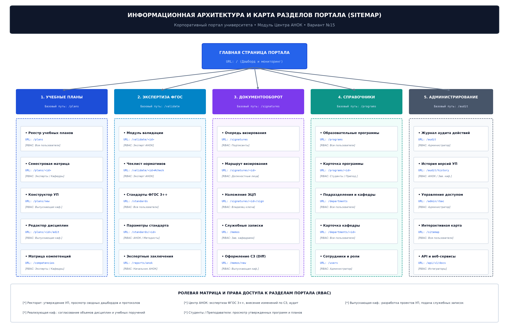

# Лабораторная работа № 4
## Создание структуры разделов и страниц портала

**Вариант 15:** Университет. Центр АНОК

## Структура разделов

PHP-приложение использует параметр `page` для перехода между разделами:

| Раздел | Адрес |
|---|---|
| Сводная панель | `?page=dashboard` |
| Учебные планы | `?page=plans` |
| Учебный план | `?page=plan&id=1&sem=1` |
| Проверка ФГОС | `?page=validate` |
| Согласование | `?page=signatures` |
| Служебные записки | `?page=memos` |
| Программы | `?page=programs` |
| Компетенции | `?page=competencies` |
| Стандарты | `?page=standards` |
| Подразделения | `?page=departments` |
| Объявления | `?page=announcements` |
| Аудит | `?page=audit` |
| Карта сайта | `?page=sitemap` |

Все страницы используют общий заголовок, меню, основную область и таблицы данных. Ссылки меню формируются в `portal/index.php`.

## Заключение

Сверстаны основные разделы и страницы PHP-портала, связанные с базой MySQL/MariaDB.
