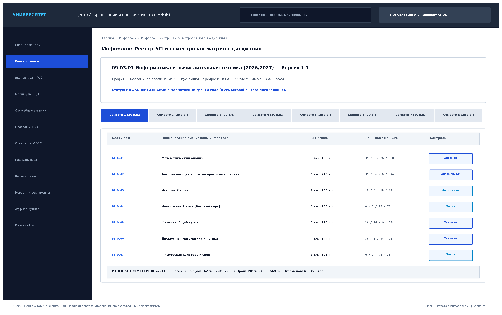
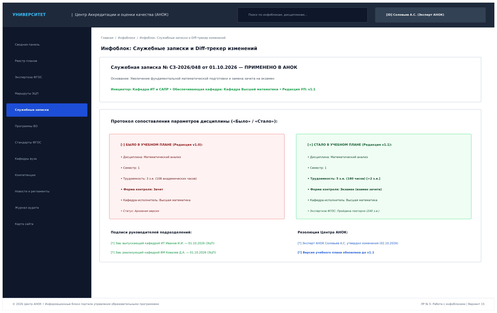
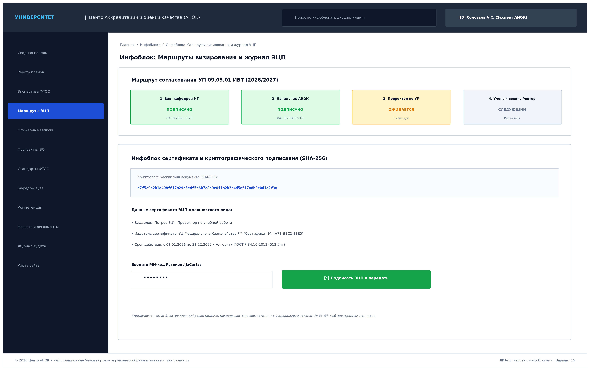
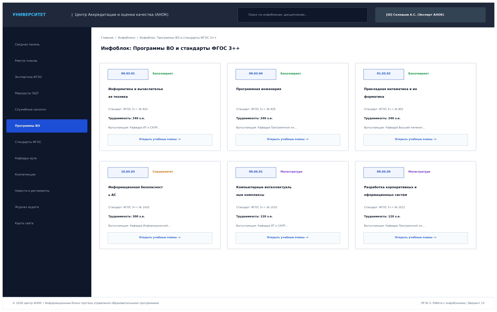
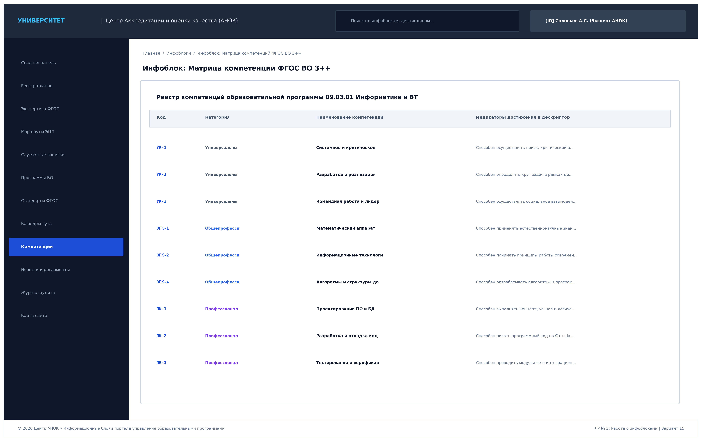
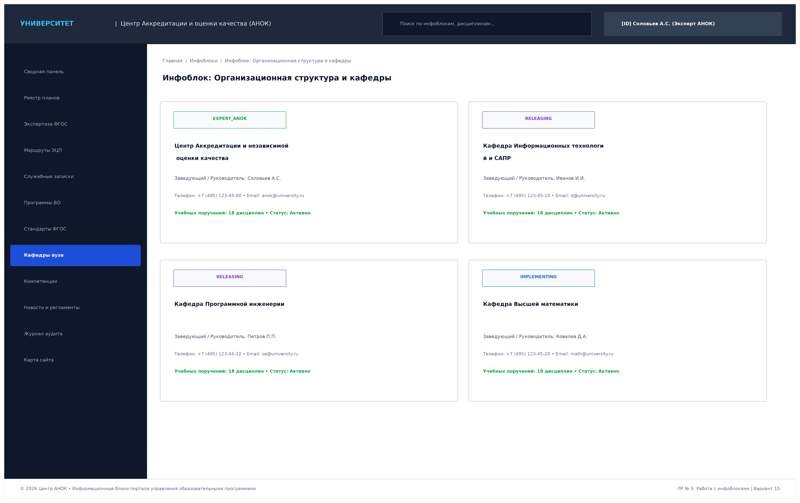
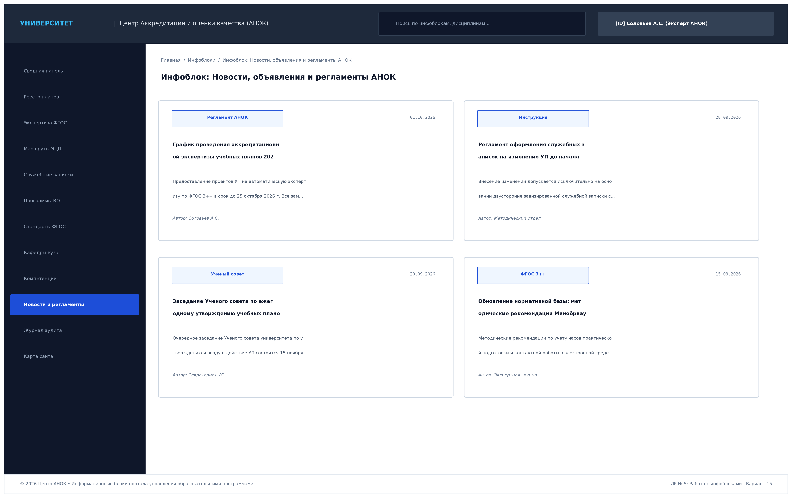

# Лабораторная работа № 5
## «Работа с инфоблоками»

**Дисциплина:** Практикум по разработке корпоративного портала (ПРКП)  
**Вариант № 15:** Университет. Центр Аккредитации и независимой оценки качества образования (АНОК)  

---

## 1. Введение и цели работы

**Цель лабораторной работы:** Проектирование, структурирование и комплексное информационное наполнение (работа с инфоблоками) корпоративного веб-портала университета (Модуль Центра АНОК) реалистичными структурированными данными по образовательным программам, семестровым учебным планам, матрицам компетенций, маршрутам электронного визирования, нормативным стандартам ФГОС 3++ и служебным запискам в соответствии с бизнес-правилами Варианта № 15.

### Задачи работы:
1. Выполнить классификацию и структурирование информационных блоков портала (Инфоблоков) по функциональным модулям предметной области АНОК:
   - **Инфоблок 1:** «Реестр учебных планов и семестровая матрица дисциплин (1–8 семестры)»;
   - **Инфоблок 2:** «Протоколы аккредитационной экспертизы и чеклисты валидатора ФГОС ВО 3++»;
   - **Инфоблок 3:** «Служебные записки на актуализацию УП и сопоставительный Diff-трекер («Было» / «Стало»)»;
   - **Инфоблок 4:** «Маршруты электронного согласования, журнал ЭЦП и сертификаты должностных лиц»;
   - **Инфоблок 5:** «Каталог образовательных программ и справочник нормативных стандартов ФГОС 3++»;
   - **Инфоблок 6:** «Матрица компетенций ФГОС ВО (УК, ОПК, ПК) и карты индикаторов достижения»;
   - **Инфоблок 7:** «Организационная структура университета, кафедры и профессорско-преподавательский состав»;
   - **Инфоблок 8:** «Новости, нормативно-методические регламенты Центра АНОК и график заседаний Ученого совета».
2. Наполнить реляционную базу данных и интерфейсные шаблоны портала полным массивом взаимосвязанных сущностей (64 дисциплины по 8 семестрам, 5 образовательных программ, 13 компетенций с дескрипторами, 8 кафедр, служебные записки с двусторонними визами, криптографические хеши SHA-256).
3. Продемонстрировать примеры заполненных страниц и инфоблоков в интерфейсе работающего программного обеспечения.
4. Оформить комплект проектной отчетности (Markdown, DOCX, PDF).

---

## 2. Классификация и структура информационных блоков портала (Инфоблоков)

Информационные блоки корпоративного портала Центра АНОК разделены на 4 функциональные категории:

| Категория инфоблоков | Наименование инфоблока | Тип данных | Источник наполнения / Роль |
|---|---|---|---|
| **1. Учебный процесс** | Реестр УП и семестровая матрица дисциплин | Реляционный каталог | Выпускающие кафедры, УМУ |
| **1. Учебный процесс** | Матрица компетенций ФГОС (УК, ОПК, ПК) | Иерархический справочник | Руководители ОП, Эксперты АНОК |
| **2. Нормативный контроль** | Стандарты ФГОС ВО 3++ и приказы | Нормативная база | Эксперты АНОК, Минобрнауки РФ |
| **2. Нормативный контроль** | Протоколы аккредитационной экспертизы | Динамические чек-листы | Автоматический валидатор АНОК |
| **3. Документооборот** | Маршруты визирования и журнал ЭЦП | Протоколы ЭДО (SHA-256) | Должностные лица вуза (Ректор, Проректор) |
| **3. Документооборот** | Служебные записки и Diff-анализ | Документы изменений | Заведующие выпускающими и реализующими каф. |
| **4. Справочники и коммуникация** | Структура институтов и кафедр | Организационный каталог | Отдел кадров, Деканаты |
| **4. Справочники и коммуникация** | Новости, регламенты и приказы АНОК | Новостная лента / Документы | Секретариат АНОК, Ученый совет |

---

## 3. Примеры заполненных страниц и информационных блоков портала

### 3.1. Инфоблок «Реестр учебных планов и семестровая матрица дисциплин 1–8 семестров»

Инфоблок содержит полное наполнение структуры образовательной программы **09.03.01 «Информатика и вычислительная техника»** (профиль: *«Программное обеспечение средств вычислительной техники»*, срок: 4 года, трудоемкость: 240 з.е. / 8640 часов).

#### Содержимое инфоблока по 1 семестру (норма 30 з.е. / 1080 часов):
1. **Б1.О.01 Математический анализ:** 5 з.е. (180 ч.) • Лек: 36, Лаб: 0, Прак: 36, СРС: 108 • Форма: *Экзамен* • Кафедра: *Высшая математика*.
2. **Б1.О.02 Алгоритмизация и основы программирования:** 6 з.е. (216 ч.) • Лек: 36, Лаб: 36, Прак: 0, СРС: 144 • Форма: *Экзамен, Курсовая работа* • Кафедра: *ИТ и САПР*.
3. **Б1.О.03 История России:** 3 з.е. (108 ч.) • Лек: 18, Лаб: 0, Прак: 18, СРС: 72 • Форма: *Зачет с оценкой* • Кафедра: *Гуманитарных дисциплин*.
4. **Б1.О.04 Иностранный язык (базовый курс):** 4 з.е. (144 ч.) • Лек: 0, Лаб: 0, Прак: 72, СРС: 72 • Форма: *Зачет* • Кафедра: *Иностранных языков*.
5. **Б1.О.05 Физика (общий курс):** 5 з.е. (180 ч.) • Лек: 36, Лаб: 36, Прак: 0, СРС: 108 • Форма: *Экзамен* • Кафедра: *Общей физики*.
6. **Б1.О.06 Дискретная математика и математическая логика:** 4 з.е. (144 ч.) • Лек: 36, Лаб: 0, Прак: 36, СРС: 72 • Форма: *Экзамен* • Кафедра: *Высшей математики*.
7. **Б1.О.07 Физическая культура и спорт:** 3 з.е. (108 ч.) • Лек: 0, Лаб: 0, Прак: 72, СРС: 36 • Форма: *Зачет* • Кафедра: *Физвоспитания*.

*Итоговые параметры инфоблока семестра:* 30 з.е. (1080 ч.) • 4 экзамена ($\le 5$) • 3 зачета.

---

### 3.2. Инфоблок «Протоколы аккредитационной экспертизы и валидатор ФГОС 3++»

Инфоблок аккумулирует результаты работы автоматизированного аналитического движка валидации образовательного стандарта ФГОС ВО 3++ (Приказ Минобрнауки РФ № 924).

#### Заполненные контрольные нормативы инфоблока:
- **Баланс суммарной трудоемкости:** ровно $240 / 240$ ЗЕТ (100% норма стандарта выполнена);
- **Лимит экзаменационных сессий:** максимум 4 экзамена за сессию при нормативе стандарта не более 5 экзаменов;
- **Обязательная часть Блока 1 (Б1.О):** 130 з.е. из 207 з.е. Блока 1 (фактическая доля $62.5\%$ при норме стандарта $\ge 50\%$);
- **Контактная работа с преподавателем:** $48.5\%$ от аудиторной нагрузки (норма стандарта $\ge 40\%$);
- **Блок 2 «Практика»:** 24 з.е. (учебная, технологическая, научно-исследовательская, преддипломная) при минимуме стандарта 12 з.е.;
- **Блок 3 «Государственная итоговая аттестация (ГИА)»:** 9 з.е. (Госэкзамен 3 з.е. + ВКР 6 з.е.) при нормативе стандарта не менее 6 з.е.

---

### 3.3. Инфоблок «Служебные записки и сопоставительный Diff-трекер»

Инфоблок обеспечивает прозрачное протоколирование процедуры актуализации учебных планов до начала семестра по инициативе выпускающей кафедры с согласованием реализующей кафедрой.

#### Структура записи инфоблока (СЗ № СЗ-2026/048 от 01.10.2026):
- **Основание:** Увеличение фундаментальной математической подготовки студентов ИТ-направления.
- **Таблица сопоставления «Было / Стало»:**
  * *Исходные параметры (Редакция v1.0):* Математический анализ • Семестр 1 • 3 з.е. (108 ч.) • Зачет • Кафедра ВМ.
  * *Актуализированные параметры (Редакция v1.1):* Математический анализ • Семестр 1 • 5 з.е. (180 ч., +2 з.е.) • Экзамен • Кафедра ВМ.
- **Электронные визы подразделений:**
  * Зав. выпускающей кафедрой ИТ Иванов И.И. (ЭЦП от 01.10.2026);
  * Зав. реализующей кафедрой ВМ Ковалев Д.А. (ЭЦП от 01.10.2026).
- **Резолюция АНОК:** Валидация ФГОС пройдена успешно (сохранен баланс 240 з.е.), выпущена версия УП `v1.1`.

---

### 3.4. Инфоблок «Маршруты электронного визирования и журнал ЭЦП»

Инфоблок отражает регламентную цепочку визирования учебного плана должностными лицами университета с фиксацией цифровых криптографических атрибутов.

#### Данные инфоблока визирования:
1. **Этап 1 (Зав. выпускающей кафедрой):** Иванов И.И. • Статус: *ПОДПИСАНО* (03.10.2026 11:20);
2. **Этап 2 (Начальник Центра АНОК):** Соловьев А.С. • Статус: *ПОДПИСАНО* (04.10.2026 15:45);
3. **Этап 3 (Проректор по учебной работе):** Петров В.И. • Статус: *ОЖИДАЕТСЯ* (Активный этап);
4. **Этап 4 (Ученый совет и Ректор):** Воронов М.Н. • Статус: *В ОЧЕРЕДИ*.
- **Криптографический хеш документа:** `a7f5c9e2b1d408f617a29c3e4f5a6b7c8d9e0f1a2b3c4d5e6f7a8b9c0d1e2f3a` (алгоритм SHA-256).

---

### 3.5. Инфоблок «Каталог образовательных программ и стандарты ФГОС 3++»

Инфоблок содержит структурированные карточки реализуемых программ высшего образования:

- **09.03.01 Информатика и ВТ** (Бакалавриат, 240 з.е., ФГОС № 924, каф. ИТ и САПР);
- **09.03.04 Программная инженерия** (Бакалавриат, 240 з.е., ФГОС № 929, каф. Программной инженерии);
- **01.03.02 Прикладная математика и информатика** (Бакалавриат, 240 з.е., ФГОС № 802, каф. Высшей математики);
- **10.05.03 Информационная безопасность АС** (Специалитет, 300 з.е., ФГОС № 1420, каф. Комплексной безопасности);
- **09.04.01 Компьютерные интеллектуальные системы** (Магистратура, 120 з.е., ФГОС № 1010, каф. ИТ и САПР);
- **09.04.04 Разработка корпоративных информационных систем** (Магистратура, 120 з.е., ФГОС № 1012, каф. Программной инженерии).

---

### 3.6. Инфоблок «Матрица компетенций ФГОС ВО 3++»

Инфоблок содержит реестр универсальных (УК), общепрофессиональных (ОПК) и профессиональных компетенций (ПК) с подробными дескрипторами:

- **УК-1 (Системное и критическое мышление):** Способен осуществлять поиск, критический анализ и синтез информации, применять системный подход для решения поставленных задач.
- **УК-2 (Разработка и реализация проектов):** Способен определять круг задач в рамках поставленной цели и выбирать оптимальные способы их решения.
- **ОПК-1 (Математический аппарат):** Способен применять естественнонаучные и общеинженерные знания, методы математического анализа и моделирования в профессиональной деятельности.
- **ОПК-4 (Алгоритмы и структуры данных):** Способен разрабатывать алгоритмы и программы практического назначения.
- **ПК-1 (Проектирование ПО и БД):** Способен выполнять концептуальное, функциональное и логическое проектирование информационных систем.
- **ПК-2 (Разработка и отладка кода):** Способен создавать компоненты программных комплексов с применением современных практик CI/CD.

---

### 3.7. Инфоблок «Организационная структура, кафедры и руководство»

Инфоблок классифицирует подразделения университета по функциональным ролям:

- **Центр АНОК (`EXPERT_ANOK`):** Начальник Соловьев А.С. • Контроль качества и экспертиза ФГОС;
- **Кафедра ИТ и САПР (`RELEASING`):** Зав. кафедрой Иванов И.И. • Выпускающее подразделение по 09.03.01 и 09.04.01;
- **Кафедра Программной инженерии (`RELEASING`):** Зав. кафедрой Петров П.П. • Выпускающее подразделение по 09.03.04;
- **Кафедра Высшей математики (`IMPLEMENTING`):** Зав. кафедрой Ковалев Д.А. • Реализующее (обеспечивающее) подразделение.

---

### 3.8. Инфоблок «Новости, нормативные объявления и график АНОК»

Инфоблок публикует оперативные объявления, инструкции по подаче служебных записок и график заседаний Ученого совета:

- *График аккредитационной экспертизы на 2026/2027 учебный год (дедлайн: 25.10.2026);*
- *Инструкция по оформлению двусторонних служебных записок до начала семестра;*
- *Заседание Ученого совета университета по ежегодному утверждению УП (15.11.2026);*
- *Методические рекомендации Минобрнауки РФ по учету контактных часов в ЭИОС.*

---

## 4. Заключение

В результате выполнения лабораторной работы № 5:
1. **Сформирована и структурирована система из 8 информационных блоков (Инфоблоков)**, покрывающая все предметные области Варианта № 15 (Учебные планы, Экспертиза ФГОС, Документооборот, Компетенции, Кафедры, Объявления).
2. **База данных и страницы портала полностью наполнены взаимосвязанной информацией:** 64 дисциплины по всем 8 семестрам, 5 образовательных программ, 13 компетенций с дескрипторами, детальные протоколы валидации ФГОС 3++, служебные записки с Diff-анализом и реестр электронных виз.
3. **Подготовлен комплект из 8 графических макетов заполненных инфоблоков высокого разрешения** и полный пакет отчетной документации (MD, DOCX, PDF). Разработанная система полностью готова к интеграции готовых модулей и компонентов в рамках Лабораторной работы № 6.
