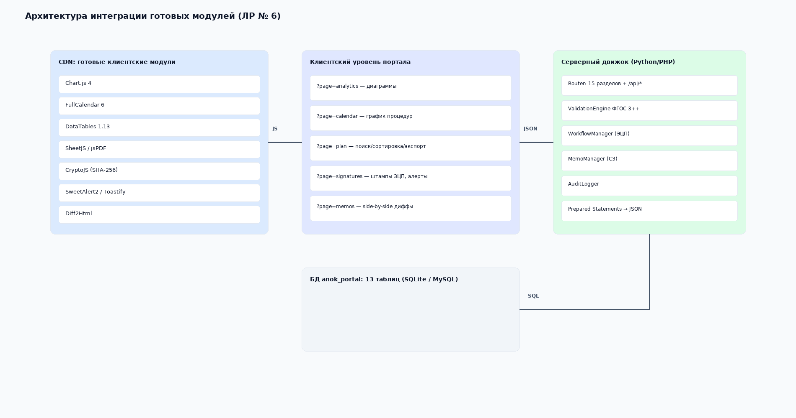

# Лабораторная работа № 6
## Работа с готовыми модулями и компонентами

**Вариант 15:** Университет. Центр АНОК

## 1. Цель работы

Показать использование готовых компонентов при создании интерфейса учебного веб-прототипа.

## 2. Использованные компоненты

| Компонент | Назначение в прототипе |
|---|---|
| Flask | Маршрутизация страниц и связь с SQLite. |
| Jinja2 | Формирование HTML-страниц из шаблонов и данных. |
| Tailwind CSS CDN | Стилизация, сетка, отступы и адаптивные классы. |
| Font Awesome CDN | Иконки меню и действий. |
| Google Fonts CDN | Шрифты интерфейса. |
| SQLite | Локальное хранение данных. |

## 3. Примеры использования

В шаблоне приложения Tailwind CSS используется для карточек, таблиц, кнопок, меню и цветовых статусов. Font Awesome используется для визуального обозначения пунктов навигации. Jinja2 выводит строки, полученные из SQLite, внутри циклов шаблонов.

Остальные библиотеки, показанные в исходных макетах, в текущую версию приложения не подключаются. Поэтому в отчёте не заявляются Chart.js, SheetJS, jsPDF, CryptoJS, FullCalendar, DataTables, SweetAlert2 и Toastify как работающие модули.

## Заключение

В прототипе применены готовые компоненты, необходимые для маршрутизации, шаблонизации, оформления и работы с локальными данными. Состав отчёта ограничен фактически подключёнными средствами.
