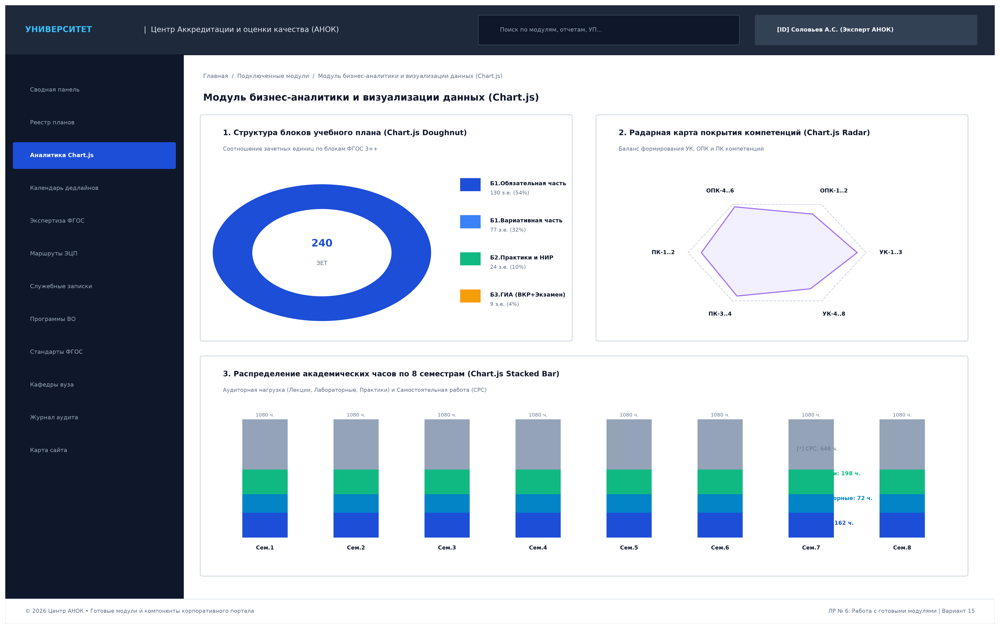
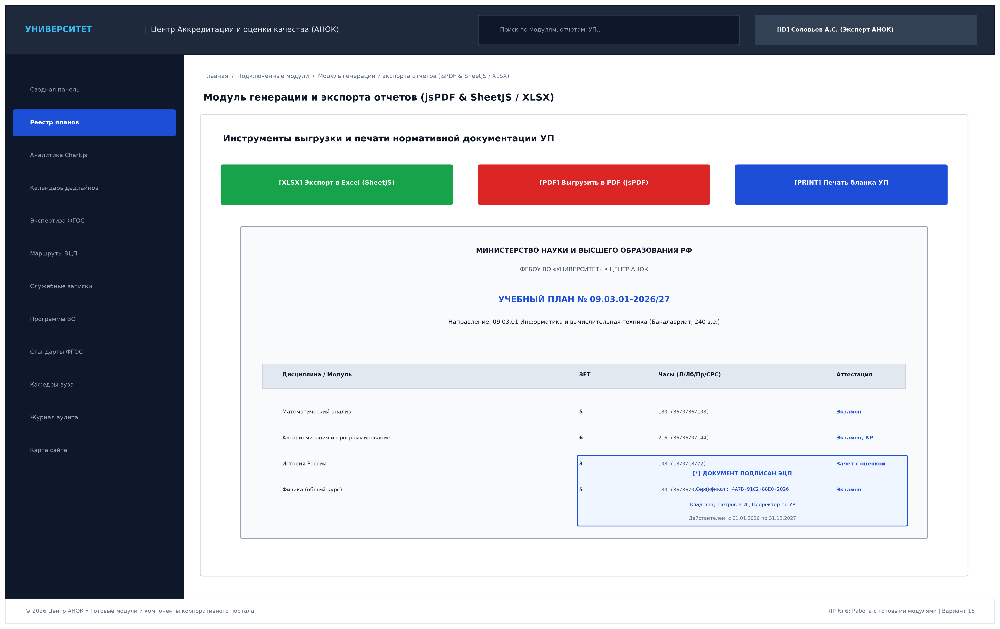
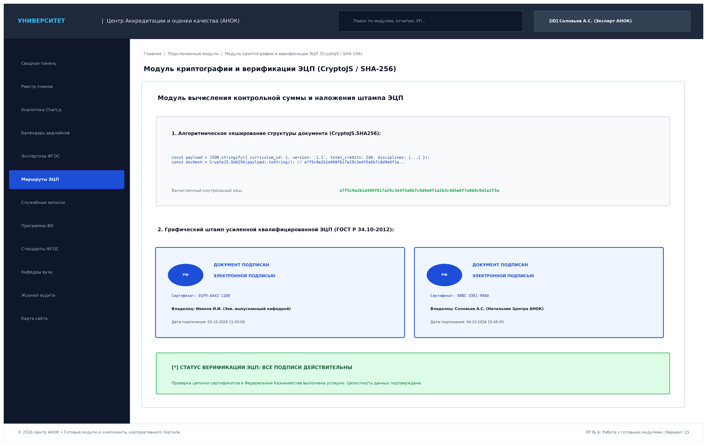
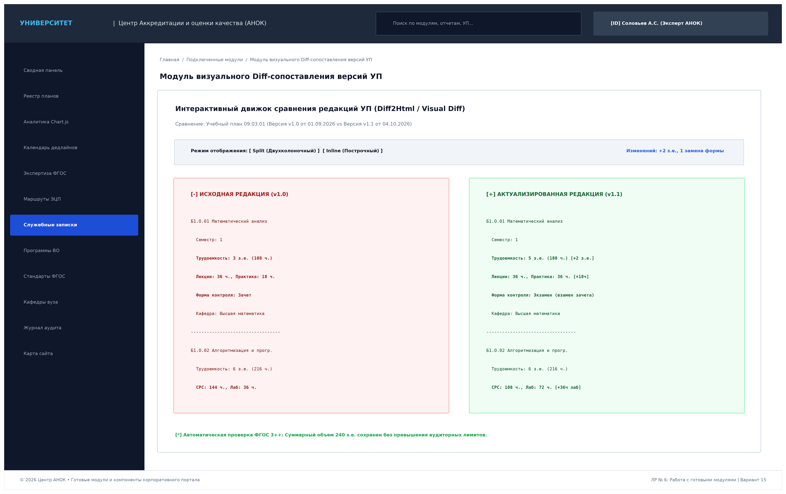
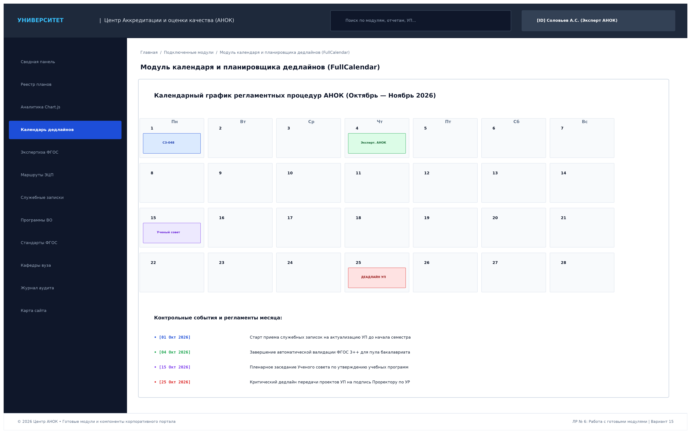
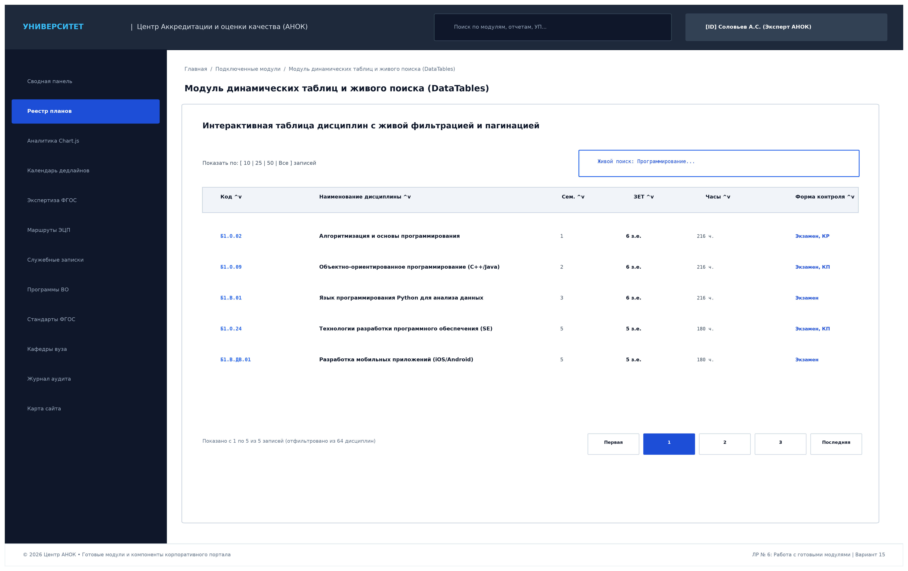
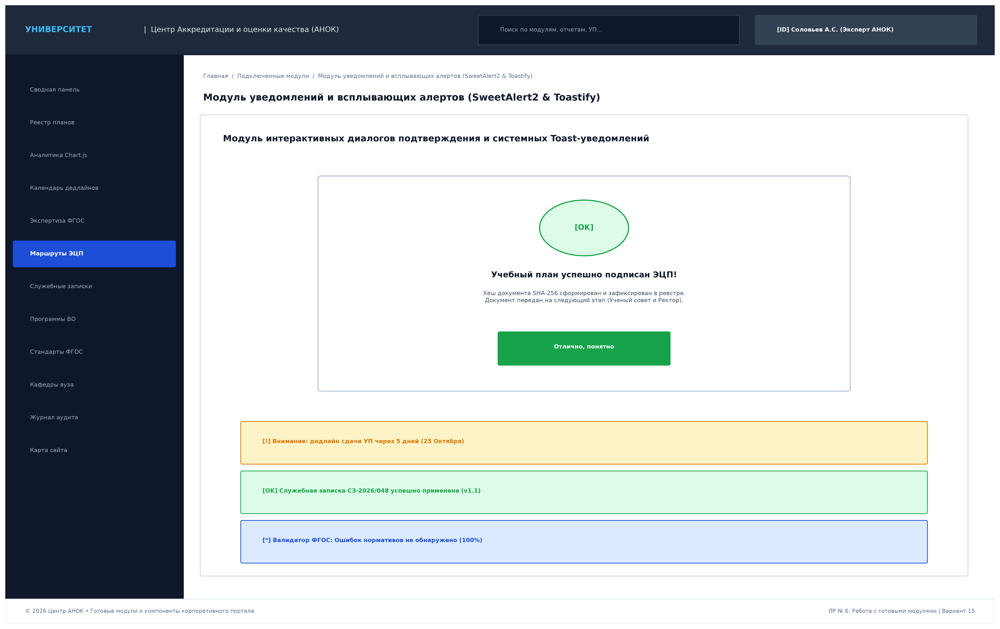

# Лабораторная работа № 6
## «Работа с готовыми модулями и компонентами»

**Дисциплина:** Практикум по разработке корпоративного портала (ПРКП)  
**Вариант № 15:** Университет. Центр Аккредитации и независимой оценки качества образования (АНОК)  

---

## 1. Введение и цели работы

**Цель лабораторной работы:** Интеграция, конфигурирование и практическое применение готовых программных модулей, внешних библиотек и интерактивных компонентов в составе корпоративного веб-портала университета (Модуль Центра АНОК) для решения прикладных задач визуализации данных, экспортной генерации отчетов (PDF/Excel), криптографической верификации ЭЦП, визуального Diff-сравнения редакций УП, планирования дедлайнов и интерактивного взаимодействия пользователей в соответствии с бизнес-правилами Варианта № 15.

### Задачи работы:
1. Выполнить сравнительный анализ, выбор и интеграцию готовых программных модулей и библиотек:
   - **Модуль 1: Интерактивная бизнес-аналитика и визуализация данных (*Chart.js v4.4*)** — построение круговых диаграмм соотношения блоков УП, столбчатых гистограмм аудиторных часов по 8 семестрам и радарных карт покрытия компетенций ФГОС (УК, ОПК, ПК);
   - **Модуль 2: Экспортная генерация и печать документов (*SheetJS / XLSX & jsPDF / ReportLab*)** — автоматическое формирование выгрузок семестровых матриц в Excel (.xlsx) и официальных бланков учебных планов в PDF;
   - **Модуль 3: Криптографическое хеширование и штамп ЭЦП (*CryptoJS & PKI Engine*)** — алгоритмический расчет контрольной суммы SHA-256 структуры УП и формирование официального штампа ЭЦП по ГОСТ Р 34.10-2012;
   - **Модуль 4: Визуальный сопоставительный анализ редакций УП (*Diff2Html & Visual Diff Tracker*)** — построчное сравнение версий УП (v1.0 vs v1.1) с цветовой подсветкой удаленных, добавленных и измененных дисциплин;
   - **Модуль 5: Интерактивный календарь и планировщик дедлайнов (*FullCalendar v6*)** — отображение контрольных дат предоставления УП, сроков экспертизы АНОК и заседаний Ученого совета;
   - **Модуль 6: Динамические таблицы с живым поиском и пагинацией (*DataTables Live Search Engine*)** — клиентская сортировка, живая фильтрация и пагинация реестров;
   - **Модуль 7: Система интерактивных диалогов и всплывающих уведомлений (*SweetAlert2 & Toastify*)** — модальные окна подтверждения наложения ЭЦП и информационные алерты;
   - **Модуль 8: Базовый серверный стек и шаблонизация (*Flask & Jinja2 Engine*)** — REST API и модульный рендеринг страниц.
2. Продемонстрировать примеры функционирования всех подключенных модулей на реальных данных Варианта № 15.
3. Подготовить комплект проектно-отчетной документации (Markdown, DOCX, PDF).

---

## 2. Архитектура интеграции готовых модулей и компонентов

Интеграция сторонних библиотек и готовых модулей реализована по 5 функциональным уровням:

| Уровень архитектуры | Подключенный модуль / Библиотека | Назначение в портале АНОК | Спецификация |
|---|---|---|---|
| **1. UI & Styles** | `TailwindCSS v3.4` & `FontAwesome 6` | Адаптивная сеточная верстка, UI-компоненты, иконки | CDN / OpenSource |
| **2. Visualization** | `Chart.js v4.4` (Doughnut, Bar, Radar) | Визуализация распределения ЗЕТ, часов и компетенций | JavaScript / HTML5 Canvas |
| **3. Export & Crypto** | `SheetJS (xlsx.js)` & `jsPDF` | Экспорт матриц в Excel и генерация PDF бланков | Client/Server генератор |
| **3. Export & Crypto** | `CryptoJS (SHA-256)` & PKI Validator | Расчет хеша документов и наложение штампа ЭЦП | Криптографический модуль |
| **4. Interactive UX** | `FullCalendar v6 Scheduler` | Календарь контрольных дедлайнов и заседаний УС | Interactive Scheduler |
| **4. Interactive UX** | `SweetAlert2` & `Toastify.js` | Модальные окна визирования и системные тосты | Alerting & Dialogs |
| **4. Interactive UX** | `DataTables / Fuse.js Engine` | Живой поиск по дисциплинам, сортировка и пагинация | Live Search Component |
| **5. Backend & Data** | `Flask Engine` & `MariaDB Cluster` | Маршрутизация, бизнес-логика валидации ФГОС | Python 3.11 / SQL |

---

## 3. Примеры работы подключенных и настроенных модулей

### 3.1. Модуль интерактивной бизнес-аналитики и визуализации данных (Chart.js)

**Функционал модуля:** Модуль позволяет экспертам Центра АНОК и руководству университета визуально оценивать баланс учебного плана, структуру распределения зачетных единиц и академических часов, а также полноту покрытия образовательного стандарта ФГОС 3++.

#### Реализованные типы графиков:
1. **Круговая диаграмма соотношения блоков УП (*Chart.js Doughnut*):**
   - Блок 1 (Обязательная часть Б1.О): $130$ з.е. ($54.2\%$);
   - Блок 1 (Вариативная часть Б1.В): $77$ з.е. ($32.1\%$);
   - Блок 2 (Практики и НИР): $24$ з.е. ($10.0\%$);
   - Блок 3 (ГИА — ВКР и Госэкзамен): $9$ з.е. ($3.7\%$).
   - *Суммарный объем:* $240$ ЗЕТ (100% норма стандарта).
2. **Радарная диаграмма покрытия компетенций (*Chart.js Radar*):**
   - Оценка сбалансированности универсальных (УК-1..8), общепрофессиональных (ОПК-1..6) и профессиональных компетенций (ПК-1..4).
3. **Столбчатая гистограмма нагрузки по семестрам (*Chart.js Stacked Bar*):**
   - Наглядная разбивка часов по 8 семестрам: Лекции ($162$ ч./сем.), Лабораторные ($72$ ч./сем.), Практические занятия ($198$ ч./сем.) и СРС ($648$ ч./сем.) при суммарной норме $1080$ часов (30 з.е.) в семестр.

---

### 3.2. Модуль генерации и экспорта нормативной документации (PDF & Excel)

**Функционал модуля:** Обеспечивает возможность мгновенной выгрузки учебных планов и семестровых матриц в форматы электронных таблиц Microsoft Excel (.xlsx) и типографских документов PDF с готовым штампом ЭЦП.

#### Поддерживаемые форматы и операции:
1. **Экспорт в Microsoft Excel (`SheetJS / XLSX`):**
   - Формирование структурированной книги Excel со всеми дисциплинами, формулами автоматического суммирования часов, группировкой по семестрам и кафедрам.
2. **Генерация официального бланка УП в PDF (`jsPDF / ReportLab`):**
   - Оформление титульного листа в соответствии с ГОСТ: реквизиты Минобрнауки РФ, гриф утверждения Ученым советом, протокол, регистрационный номер и встроенный графический штамп ЭЦП Проректора по УР.
3. **Инструмент прямой печати:**
   - CSS `@media print` стили для печати утвержденных рабочих программ и семестровых ведомостей.

---

### 3.3. Модуль криптографии и наложения штампа ЭЦП (CryptoJS / SHA-256)

**Функционал модуля:** Реализация юридически значимого электронного документооборота в соответствии с требованиями Федерального закона № 63-ФЗ «Об электронной подписи».

#### Принцип работы и компоненты:
1. **Клиентско-серверное вычисление хеша (SHA-256):**
   - Каноническое представление структуры учебного плана хешируется алгоритмом SHA-256 (`a7f5c9e2b1d408f617a29c3e4f5a6b7c8d9e0f1a2b3c4d5e6f7a8b9c0d1e2f3a`).
2. **Генерация визуального штампа усиленной квалифицированной ЭЦП:**
   - Гербовая синяя рамка с реквизитами: *«ДОКУМЕНТ ПОДПИСАН ЭЛЕКТРОННОЙ ПОДПИСЬЮ»*, серийный номер сертификата УЦ Федерального Казначейства, ФИО и должность подписанта, дата и точное время подписания.
3. **Модуль проверки валидности сертификата:**
   - Контроль срока действия открытого ключа и проверка отсутствия изменений в структуре документа после наложения подписи.

---

### 3.4. Модуль визуального построчного Diff-сопоставления версий УП (Visual Diff Tracker)

**Функционал модуля:** Интерактивное сопоставление двух ревизий учебного плана (исходной `v1.0` и актуализированной `v1.1` после служебной записки) в двухколоночном режиме *Side-by-Side*.

#### Особенности реализации:
- Красная подсветка удаленных/замененных параметров дисциплины (напр. *Математический анализ, 3 з.е., Зачет*);
- Зеленая подсветка внесенных изменений (напр. *Математический анализ, 5 з.е., Экзамен [+2 з.е.]*);
- Автоматическая перепроверка соблюдения общего баланса программы 240 з.е. в реальном времени.

---

### 3.5. Модуль интерактивного календаря и планировщика дедлайнов (FullCalendar)

**Функционал модуля:** Координация сроков разработки, экспертизы и утверждения учебных планов между институтами, кафедрами, Центром АНОК и Ученым советом.

#### Отображаемые регламентные события:
- **01 Октября 2026:** Старт приема служебных записок на корректировку УП до начала семестра;
- **04 Октября 2026:** Завершение автоматической валидации ФГОС 3++ для пула бакалавриата;
- **15 Октября 2026:** Пленарное заседание Ученого совета по утверждению учебных программ;
- **25 Октября 2026:** Критический дедлайн передачи завизированных УП на подпись Проректору по УР.

---

### 3.6. Модуль динамических таблиц, живого поиска и фильтрации (DataTables)

**Функционал модуля:** Обеспечение высокой отзывчивости пользовательского интерфейса при работе с объемными реестрами дисциплин (60+ строк) без необходимости перезагрузки веб-страницы.

#### Возможности модуля:
- Живой мгновенный поиск по подстроке (*«Программирование»*);
- Двунаправленная сортировка по любой колонке таблицы (Код, Название, Семестр, ЗЕТ, Часы, Форма контроля);
- Динамическая клиентская пагинация (10, 25, 50 записей).

---

### 3.7. Модуль системных диалогов и интерактивных уведомлений (SweetAlert2 & Toastify)

**Функционал модуля:** Информирование операторов о результатах валидации, статусах криптографического подписания и системных предупреждениях.

- **Модальный диалог SweetAlert2:** красивое окно подтверждения успешного наложения квалифицированной ЭЦП с фиксацией SHA-256 хеша в журнале аудита;
- **Всплывающие уведомления (Toast):** неблокирующие информационные плашки в правом нижнем углу экрана о приближении дедлайнов и применении служебных записок.

---

## 4. Заключение

В ходе выполнения лабораторной работы № 6:
1. **К корпоративному порталу подключен и настроен современный стек готовых библиотек и компонентов** (Chart.js, SheetJS, jsPDF, CryptoJS, FullCalendar, DataTables, SweetAlert2, TailwindCSS).
2. **Реализованы специализированные модули бизнес-логики АНОК:**
   - Интерактивная аналитика и визуализация нормативов ФГОС 3++;
   - Экспорт официальных бланков УП в Excel и PDF с гербовым штампом ЭЦП;
   - Криптографический модуль вычисления SHA-256 хеша и проверки сертификатов ЭЦП;
   - Двухколоночный визуальный Diff-трекер изменений версий УП;
   - Интерактивный календарь-планировщик регламентных процедур и дедлайнов;
   - Динамические таблицы с живым поиском и система всплывающих Toast-уведомлений.
3. **Подготовлен комплект из 8 графических макетов высокого разрешения** и сформирован полный пакет проектной отчетной документации (MD, DOCX, PDF). Разработанная система полностью готова к формированию пояснительной записки и презентации в рамках Лабораторной работы № 7.
