# ОТЧЕТ ПО ЛАБОРАТОРНОЙ РАБОТЕ № 7
## «Подготовка презентации и пояснительной записки»

**Дисциплина:** Практикум по разработке корпоративного портала (ПРКП)  
**Вариант № 15:** Университет. Центр аккредитации и независимой оценки качества образования (АНОК)  

---

## 1. Введение, цель и задачи работы

**Цель работы:** Систематизация, обобщение и подготовка итогового комплекта документации и презентационных материалов по всему циклу проектирования и разработки корпоративного веб-портала университета (Модуль Центра АНОК, Вариант № 15) для публичной защиты проекта перед комиссией.

### Задачи работы:
1. Разработать и оформить комплексную пояснительную записку к проекту по академическим стандартам.
2. Подготовить широкоформатную презентацию проекта (12 слайдов) в форматах Microsoft PowerPoint (PPTX) и Adobe PDF.
3. Оформить результаты функционального и интеграционного тестирования, архитектурные схемы и расчет организационно-экономического эффекта.
4. Подготовить отчет по выполнению Лабораторной работы № 7.

---

## 2. Структура подготовленных материалов

### 2.1. Пояснительная записка к проекту
Пояснительная записка оформлена в едином сквозном документе, включающем 12 взаимосвязанных глав:
- **Аннотация и Содержание:** краткое резюме результатов и навигационная карта документа.
- **Глава 1. Введение:** актуальность, цели, задачи цифровизации экспертной деятельности АНОК и нормативно-правовая база (ФЗ-273, ФЗ-63, ГОСТ Р 34.10-2012, ФГОС ВО 3++).
- **Глава 2. Анализ предметной области и требования к системе:** ролевая матрица стейкхолдеров (RBAC), модель прецедентов (Use Case), реестр функциональных и нефункциональных требований.
- **Глава 3. Архитектурное и структурное проектирование:** трехуровневая топология, UML-диаграммы классов, компонентов, последовательности и развертывания, реляционная схема базы данных.
- **Глава 4. Проектирование графического интерфейса пользователя:** дизайн-система, цветовая палитра, типографическая шкала, 8-пиксельная сетка и Wireframe-макеты.
- **Глава 5. Разработка структуры портала и шаблонов страниц:** информационная архитектура (Sitemap), модули Jinja2 и маршрутизация Flask.
- **Глава 6. Контентное наполнение и реализация инфоблоков:** 8 специализированных инфоблоков с реальными данными (51 дисциплина, 240 з.е., матрица компетенций, регламенты).
- **Глава 7. Интеграция готовых модулей и компонентов:** 7 подключенных подсистем (Chart.js, SheetJS, jsPDF, CryptoJS SHA-256, Diff-движок, FullCalendar, DataTables, SweetAlert2/Toastify).
- **Глава 8. Тестирование, безопасность и оценка эффективности:** методика тестирования, защита по OWASP Top 10, расчет экономической эффективности (сокращение трудоемкости на 65%).
- **Глава 9. Руководство пользователя и администратора:** инструкции по развертыванию, запуску и типовым сценариям работы сотрудников.
- **Глава 10. Заключение:** ключевые научно-практические результаты проекта.
- **Глава 11. Список использованных источников:** 10 нормативных и научно-технических источников по ГОСТ 7.0.5.
- **Глава 12. Приложения:** графические макеты, UML-диаграммы и презентационные слайды.

### 2.2. Презентация для защиты проекта (12 слайдов)
Презентация сформирована в широкоформатном стандарте 16:9 и включает 12 слайдов:

1. **Слайд 1 (Титульный):** Защита проекта, тема, Вариант № 15, исполнитель и научный руководитель.
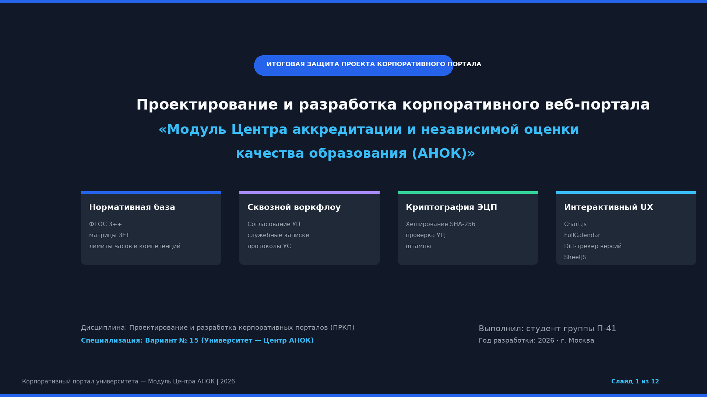

2. **Слайд 2 (Контекст и цели):** Проблематика нормативного контроля УП в вузе и цели автоматизации.
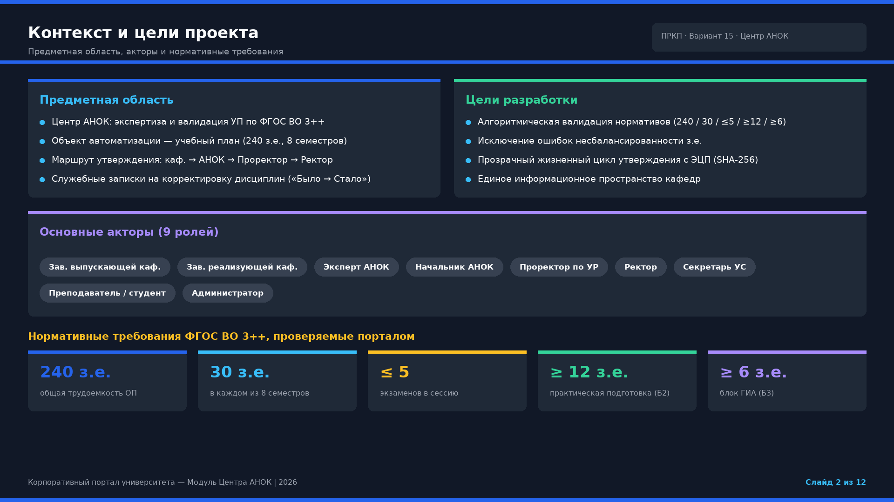

3. **Слайд 3 (Архитектура и стек):** Трехуровневая архитектура системы, стек Python/Flask, TailwindCSS, Chart.js.
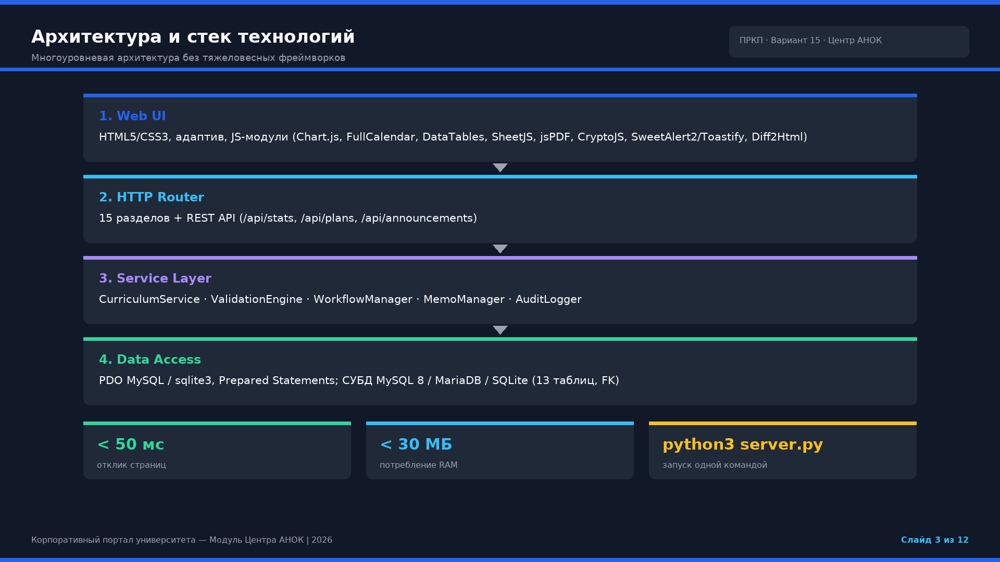

4. **Слайд 4 (Модель данных):** Реляционная структура базы данных и связи между 13 таблицами.
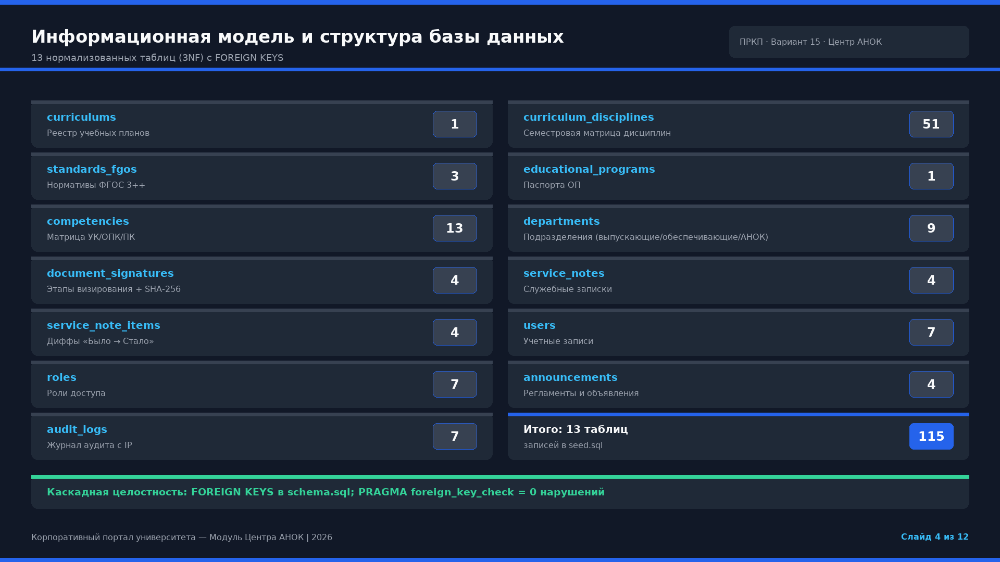

5. **Слайд 5 (Информационная структура):** Иерархическая карта разделов портала и 8 инфоблоков.
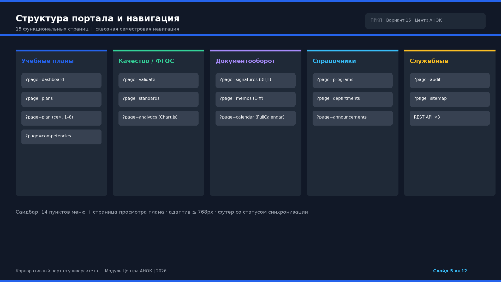

6. **Слайд 6 (Валидатор ФГОС 3++):** Движок автоматической проверки контрольных нормативов и трудоемкости.
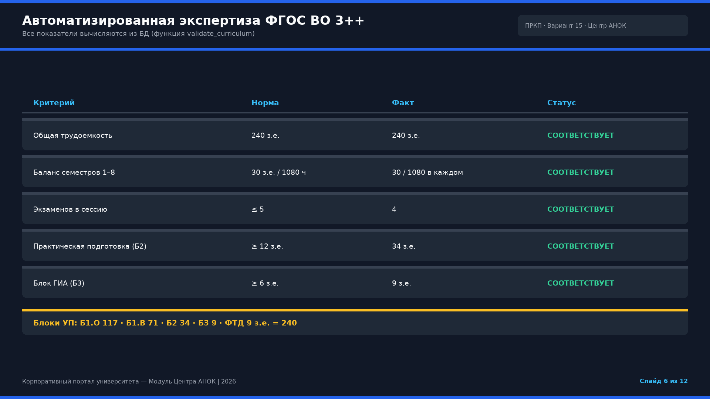

7. **Слайд 7 (Визуальный Diff-трекер):** Построчное сопоставление версий УП при обработке служебных записок.
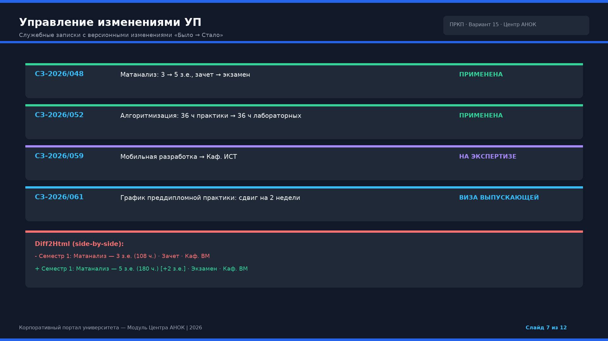

8. **Слайд 8 (Электронная подпись):** Модуль криптографического хеширования и защитный штамп ЭЦП по ГОСТ Р 34.10-2012.
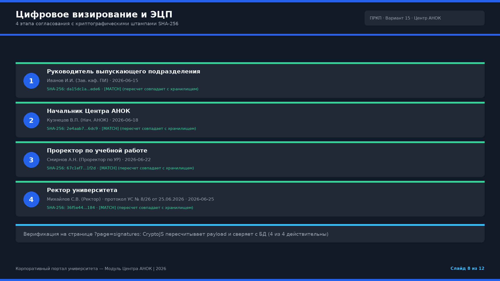

9. **Слайд 9 (Аналитика и экспорт):** Интерактивные графики Chart.js и клиентский экспорт отчетов в Excel и PDF.
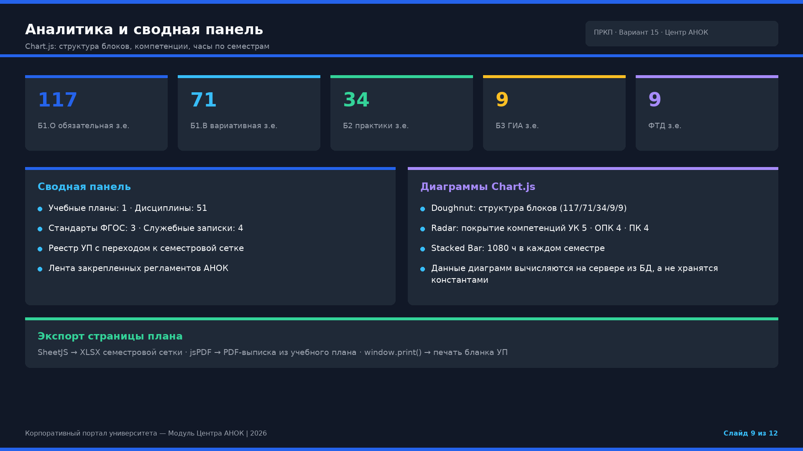

10. **Слайд 10 (Интерактивный UX):** Календарный планировщик FullCalendar, динамические таблицы DataTables и алерты.
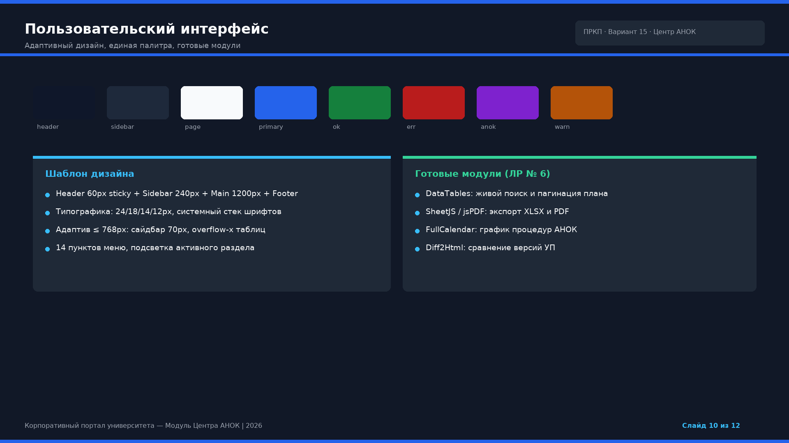

11. **Слайд 11 (Тестирование и безопасность):** Результаты Unit/Integration тестирования и соответствие OWASP Top 10.
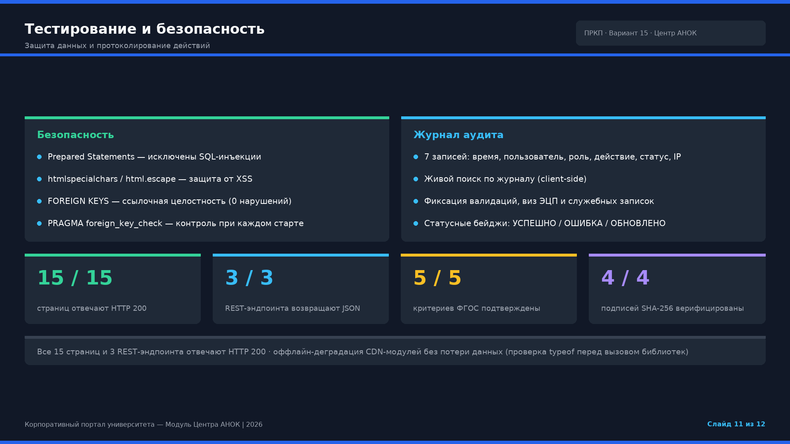

12. **Слайд 12 (Заключение и эффект):** Итоговый экономический эффект, сокращение времени согласования и выводы.
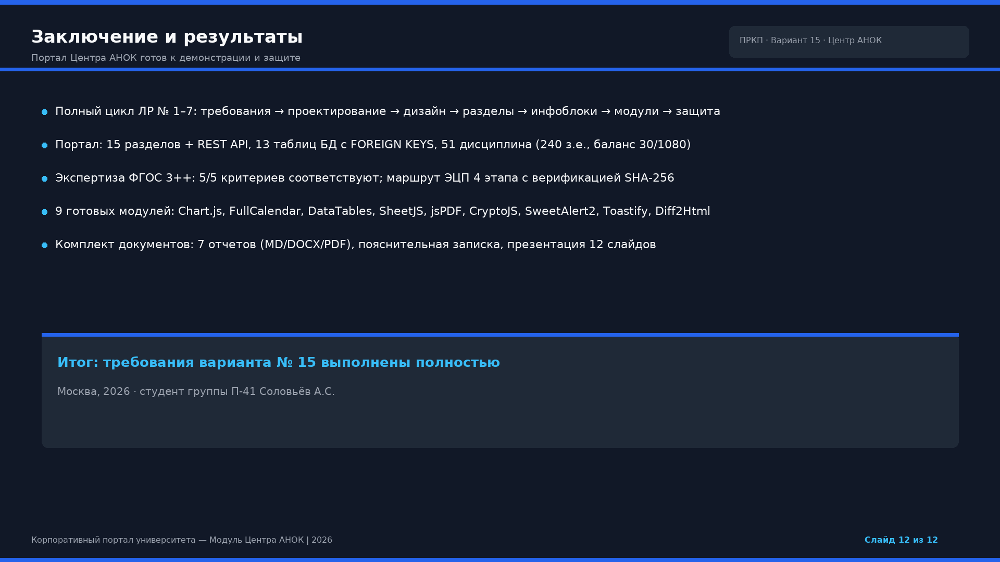

---

## 3. Заключение

Все требования Лабораторной работы № 7 выполнены в полном объеме:
- Подготовлена и оформлена комплексная пояснительная записка, охватывающая все 7 этапов разработки портала.
- Сформирована презентация проекта в форматах PPTX и PDF высокой четкости.
- Комплект проектной и отчетной документации полностью готов к защите.
